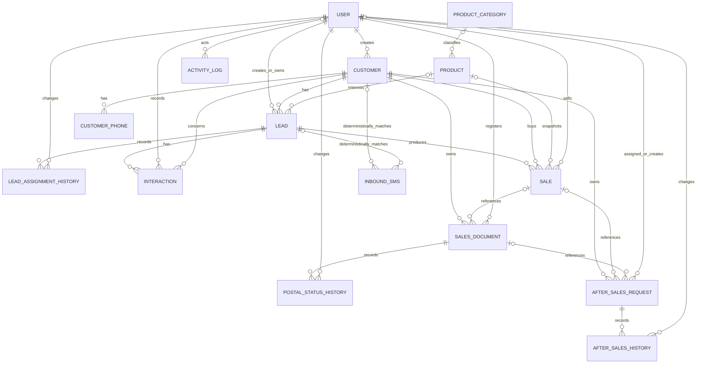

# Dolphin — Backend Specification

**Document status:** Provisional authoritative implementation specification assembled from the established Dolphin conversation context and confirmed decisions. Newer explicit user decisions override this document. **Disposition (P0 audit 2026-08-14, corrected P0R 2026-08-14): KEEP_AND_REWRITE.** This document remains the normative business/backend contract; live status, evidence, and the single decision register live only in `DOLPHIN_PROJECT_HANDOFF.md`. Section 15 below no longer duplicates that register. P0 corrected §2.3/§2.4 (stale postal/SMS blocked-module claims contradicting this document's own §5.7A/§5.9 and the actual code). P0R corrected an over-expanded Client-1 scope claim (§2.6, now three explicit tiers), an incorrect Sales Manager user-administration rule (§4/§4.1, `BIZ-005`), and an ambiguous "Linux target" architecture line — all verified by direct code inspection, not by re-reading old prose.

**Product:** Dolphin / دلفین
**Architecture:** Django + Django REST Framework + PostgreSQL + Docker Compose + Nginx, modular monolith. **Correction (P0R, 2026-08-14):** "Linux target" describes the *application container image* (Linux/amd64, per `Dockerfile`/`docs/ops/DEPENDENCIES.md`) — it is not a claim about the customer's physical hosting architecture. Whether the target host runs Linux directly, Windows Server with a Hyper-V/container layer, or a dedicated appliance is unresolved and depends on the infrastructure survey in `DOLPHIN_CLIENT1_CODEX_ROADMAP.md`'s early infrastructure-survey gate; see `DOLPHIN_PROJECT_HANDOFF.md` for the exact open questions.
**Deployment model:** Single-tenant deployment and separate database per client company, one shared codebase

---

## 1. Interpretation rules

Every requirement in this document has one of these states:

- **CONFIRMED:** explicitly stated or accepted; implement as the current requirement.
- **WORKING ASSUMPTION:** a safe default that may be implemented only when it does not lock an unresolved business decision; record it in `DOLPHIN_PROJECT_HANDOFF.md`.
- **RECOMMENDED:** technical/delivery guidance, not a contractual business rule.
- **UNRESOLVED:** do not invent; isolate/defer the affected behavior and record it in `DOLPHIN_PROJECT_HANDOFF.md`.
- **BLOCKED:** implementation must not be claimed complete until the named decision/source exists.

Frontend labels, badges, demo data, fake submit handlers, and template pages are never authoritative business rules.

---

## 2. Product goal and V1 scope

### 2.1 Confirmed product goal

Dolphin is an internal sales and customer-operations CRM for companies that receive phone/SMS-originated leads, distribute work to sales agents, track manual calls/interactions and successful sales, monitor performance, and export predefined reports to XLSX.

### 2.2 Core V1 scope

- Login, logout, current-user profile, active/inactive users.
- Four fixed CRM roles with backend-enforced permissions.
- Customers with multiple normalized phone numbers.
- Leads/opportunities that allow the same Customer to re-enter by month, campaign, batch, or product context.
- Lead assignment, reassignment, assignment history, and audit.
- Manual calls/interactions and follow-up information.
- Products and current prices; read-only to Sales Agents.
- Successful Sale records with quantity, product/price snapshots, total amount, status, and timestamps.
- Predefined in-CRM reports and XLSX exports for approved/unambiguous metrics.
- Sensitive-action audit records and request IDs.
- Dockerized local/internal deployment with database-aware health checks.
- OpenAPI documentation and automated tests.

### 2.3 Optional schema-compatible scope

`AfterSalesRequest` is implemented. It requires a Customer and may optionally reference a Sale and a `SalesDocument` (the internal operational document defined in §5.7A) — not an Invoice, which does not exist in this codebase. See §5.9 for the exact field/authorization contract.

### 2.4 Blocked implementation modules

Do not implement or claim completion for the following until a newer explicit decision defines source, creator, workflow, statuses, permissions, and acceptance criteria. Section 2.6 confirms that several families now belong to the Client-1 end target; target inclusion does not clear these implementation blocks:

- Full Invoice and InvoiceItem module.
- Invoice count/amount by city or province (this requires the Invoice module above; it is distinct from the already-implemented `SalesDocument` province/city/postal-status report, see §5.7A).
- External SMS provider integration: the live adapter/webhook only. **Correction (P0 audit, 2026-08-14):** provider-neutral internal storage and reporting over inbound SMS is implemented (see §5's InboundSMS contract in the “Entity catalog” section of this document and the “API contract” section of this document); only the live provider adapter, webhook, and outbound SMS remain blocked pending the exact material listed in the “SMS provider adapter activation requirements” section of this document.
- Automatic call-center/telephony integration.
- Ecommerce/order/shipping/payment/inventory/tax/return/refund modules.
- External website synchronization.

**Correction (P0 audit, 2026-08-14):** "Postal/shipping status and history" was removed from this list. The internal operational `SalesDocument`/`PostalStatusHistory` pair is implemented per §5.7A/§6/§7.4A of this same document and verified against the actual code; it was stale here since that feature shipped. It is not an accounting/legal Invoice and does not clear any Invoice-related block above.

**Note (P0 audit, 2026-08-14):** `ProductCategory` and `InboundSMS` are implemented entities that were added after this document's §5 was last extended. Their field/authorization contracts are maintained only in the “Entity catalog” section of this document, the “Relationship catalog” section of this document, and the “API contract” section of this document to avoid a second drift-prone copy; this document's business-rule authority (this section, §4, §9) still applies to them.

**Correction (direct product-owner decision, 2026-08-16).** The first two entries of §2.4 above — "Full Invoice and InvoiceItem module" and the inventory/order/payment part of the ecommerce line — are **no longer blocked and are now implemented.** The product owner directed that, rather than stopping on unresolved non-critical business detail, the codebase implement conservative, bounded, per-deployment-configurable semantics and document every choice. That decision outranks the earlier block, and this paragraph records the change instead of leaving the two statements to contradict the code.

What that authorised, and what it did **not**:

- **Built:** `inventory` (warehouse, stock level, append-only movement ledger, moving weighted-average purchase cost) and `billing` (Quotation, Order, Invoice/InvoiceItem, Payment, allocation, cheque, installment plan, append-only customer ledger), with receivables, gross-profit, and stock-valuation reports, and browser print/PDF for invoice and quotation. Semantics: the “Inventory semantics” section of this document, the “Billing semantics” section of this document.
- **Still blocked, unchanged:** live SMS provider adapter/webhook and outbound SMS; telephony/call-centre integration; external website/store synchronisation; payment gateway; accounting-software integration. Each still needs the exact provider material named in §2.4.
- **Deliberately not invented:** this code claims **no tax, accounting, or legal compliance for any jurisdiction**. Tax is off by default and is a single configurable percentage over one taxable base; multi-rate tax, exemptions, withholding, credit notes as a distinct document, interest, and penalties are absent rather than approximated. The §2.6 non-invention guard below therefore still stands in full for everything not listed as built above: no mandatory Invoice source, no mandatory conversion step, no mandatory inventory reservation, no mandatory Payment→Invoice allocation (payment on account is supported), and no accounting basis is asserted.

### 2.5 Out of scope by default

- Public multi-tenant SaaS.
- Microservices, Kubernetes, Redis/Celery, or complex cloud infrastructure without a concrete requirement.
- A company-facing dynamic role/permission designer.
- Implementation of all template demos/plugins/pages.
- 24/7 support or unlimited free maintenance.

**Correction (P0R audit, 2026-08-14):** the two lines below previously claimed dynamic role/permission design and dynamic report building were "confirmed" Client-1 target inclusions. That was an over-expansion of scope not backed by a direct product-owner decision. Per §2.6's Tier C, both stay out of scope by default and are not required Client-1 deliverables unless a newer direct decision explicitly approves them.

### 2.6 Client-1 scope — three tiers (corrected P0R, 2026-08-14)

**Correction (P0R audit, 2026-08-14):** this section previously stated that "every named capability family must exist in the end target" as a blanket `CONFIRMED` claim. That was an over-expansion not backed by a direct product-owner decision — it treated candidate/backlog ideas the same as approved requirements. It is replaced by three explicit tiers. This tiering is itself a direct product-owner decision and is authoritative over any earlier prose in this document or in Git history.

**Tier A — implemented baseline.** Proven by current models, migrations, services, APIs, maintained UI, and tests (verified against actual code, not claimed from templates): authentication/sessions/own profile; fixed application roles and backend object scope; users; customers and phone numbers; leads, assignment, and assignment history; interactions and follow-up; `ProductCategory` and `Product`; operational `Sale`; internal `SalesDocument` and postal history/report; `AfterSalesRequest`; provider-neutral internal `InboundSMS` storage/reporting; current performance dashboard and XLSX; `ActivityLog`; versioned API, OpenAPI, health, and current security controls.

**Tier B — confirmed Client-1 target.** **Status update (2026-08-16):** most of this tier is now implemented under the direct decision recorded in §2.4 — warehouse and inventory, stock movement, purchase cost, pricing/discount/profit semantics, Order and Quotation, Invoice and InvoiceItem, numbering/rounding/correction/cancellation, Payment, cheque, installment, customer ledger, receivables, profit reporting, and operational printing. What remains unimplemented in this tier is: secure operational files/documents, and the approved external website/store/payment/accounting integrations. The original list is kept below unchanged for traceability of what the tier contained: warehouse and inventory; stock movement; purchase cost; approved pricing/discount/profit semantics; Order and Quotation (lifecycle to be approved); accounting/legal Invoice and InvoiceItem; approved tax/numbering/rounding/correction/cancellation rules; Payment; cheque; installment; Customer Account/Ledger; receivables; approved profit/loss reporting; operational PDF and printing (expected for the first operational delivery, but blocked until the exact document meaning and a redacted approved example exist); secure operational files/documents; approved external website/store/payment/accounting integrations, only after exact providers and official documentation exist.

**Tier C — candidate or low-priority backlog.** Not confirmed Client-1 delivery requirements unless a newer direct decision explicitly approves them: dynamic role/permission designer; complete Opportunity/Pipeline; general workflow-automation engine; installable PWA; abnormal-activity detection; full Task/Project/Meeting suite; global cross-module search; saved filters; bulk XLSX import; dynamic report builder beyond specifically approved reports; every Metronic/vendor demo page; avatar/notification/session-management extensions; every communication provider beyond the one already contracted (SMS); arbitrary other template functionality. These remain possible future product capabilities, not acceptance requirements.

`FINAL_WAVE_LOW` (used in older prose/Git history for the Tier-B financial/inventory/file families) meant "required but last in implementation order," not optional. It is superseded by Tier B above; do not reintroduce it as a separate label.

All new entities, statuses, transitions, formulas, role/workstream rules, report units, provider adapters, integration directions, storage policies, migrations, routes, and acceptance criteria remain **UNRESOLVED/BLOCKED** until the exact decisions recorded in `DOLPHIN_PROJECT_HANDOFF.md` are approved. No model, endpoint, UI route, or authorization change is authorized by tier membership alone — Tier B membership means "must eventually be decided and built," not "already approved to implement."

**Explicit non-invention guard (P0R, 2026-08-14):** being technically conventional is not the same as being approved. Do not invent or silently approve any of the following merely because they are common ERP/accounting patterns: the exact source of an Invoice (whether it may be created directly from a Customer, only from a Sale, only from an Order/Quotation, or several ways); a mandatory Order→Invoice or Quotation→Order conversion step; mandatory Inventory reservation on Order/Quotation; a mandatory Payment→Invoice allocation model (payment-on-account without an Invoice must remain a considered option, not excluded by default); the accounting basis for profit/loss (cash versus accrual, cost source); tax rules of any kind; or ledger debit/credit sign conventions. `DOLPHIN_CLIENT1_CODEX_ROADMAP.md` §7.4 lists several possible workflow shapes as non-exhaustive examples only — none of them is an approval.

---

## 3. Authentication and identity

### 3.1 User model

Use a custom Django user model before production data exists.

Minimum business fields:

```text
username
first_name
last_name
phone
role
team nullable
is_active
last_login
created_at
updated_at
```

Rules:

- Passwords use Django secure hashing and are never returned, logged, or written to audit changes.
- CRM role is not modeled by `is_staff`, `is_superuser`, Django groups, or server access.
- Ordinary serializers must not expose writable `is_staff`, `is_superuser`, groups, direct permissions, or unrestricted role fields.
- Inactive users lose access immediately.
- No master password, shared hidden support account, or backdoor.

### 3.2 Authentication method

**RECOMMENDED:** same-origin Django Session Authentication + CSRF for the internal CRM.

External integrations, if later approved, require separate service credentials/API keys or tokens and must not use employee passwords.

---

## 4. Fixed application roles

```text
sales_agent
sales_manager
company_it
platform_admin
```

Legacy display levels 1–4 may remain only as display/backward-compatibility data. Permission checks use explicit role codes.

The Client-1 role identity and Persian display mapping is **CONFIRMED**:

- `sales_agent`: `بازاریاب (کال سنتر)`; a User and never a Customer; every marketer has an individual account; shared marketer accounts are prohibited.
- `sales_manager`: `مدیر فروشگاه`; the first client's store/sales manager; operational business data only, **no user-administration capability**.
- `company_it`: `مدیر فنی مشتری`; **disabled by default for Client 1** (see `PROFILE-001` / `DOC-COMPANY-IT-001` in `DOLPHIN_PROJECT_HANDOFF.md`); a future limited account requires a separate approved contract and must never grant, target, modify, or administer `platform_admin`.
- `platform_admin`: `مدیر پلتفرم`; reserved for the Dolphin owner/developer team only; for Client 1 this is the **only** role permitted to create, edit, deactivate, or reactivate application users, and the only role permitted to change application role or operator workstream. Django Admin and server/database administration are not exposed to customer users under any role.

**Correction (product-owner decision, 2026-08-18): activation state is Platform Admin only.** Turning a customer or a product active/inactive is reserved for `platform_admin`. Operational roles keep every other write on those records. Deactivation continues to hide rather than delete: every order, invoice, payment and ledger row survives untouched, and reactivation restores the record.

**Correction (product-owner decision, 2026-08-18): a marketer's customer scope is own-entry.** `sales_agent` sees the customers they entered themselves. The previous rule also granted every customer behind a lead assigned to them. Consequence, accepted deliberately: an agent working an assigned lead can no longer open that lead's customer record.

**Correction (product-owner decision, 2026-08-18): campaign target audience.** A campaign is worked from a persistent list of identities (`sales.TargetAudienceMember`) carrying name, phone and status. Status is partly derived and not freely settable: an identity moves to `engaged` ("در تعامل") when the call centre records an interaction with it, and to `customer` ("مشتری") when the same normalized phone exists in the customer book; `customer` outranks `engaged`. Only `lead` and `failed` may be set by hand. Elevated roles edit the list; `sales_agent` reads the audience of campaigns assigned to them and writes nothing.

**Correction (product-owner decision, 2026-08-18): lead status vocabulary.** `Lead.status` is exactly `pending` / `completed` / `cancelled` (در انتظار تکمیل / تکمیل / کنسل شده). It was previously free text.

**Correction (product-owner decision, 2026-08-18): hand-recorded stock movements.** The movement write endpoint accepts exactly `opening`, `return_in` and `sale`. Other kinds remain in the model and are written by the operation that produces them (transfer, order issue), never typed in.

**Correction (product-owner decision, 2026-08-18): no role changes a password.** A password is set once, when the account is created. No interface offers to change one and the API refuses `password` on update, for every role including `platform_admin`. This removes an in-application credential-reset path entirely rather than restricting it. A forgotten password is recovered on the deployment host with `manage.py changepassword`, which needs server access rather than a session; the consequence — that account recovery now requires the operator, and that there is still no self-service reset (requirement 1.6 remains `BLOCKED_EXTERNAL` for want of an email/SMS provider) — is accepted deliberately.

**Correction (PM decisions, 2026-08-18).** The following supersede earlier
statements where they differ:

* **Marketer scope is own-work.** A `sales_agent` sees only the customers they
  personally created and may not edit them, only the leads assigned to them, and
  only the orders and invoices they raised themselves. Enforced in
  `sales/selectors.py` and `billing/selectors.py`, not in templates.
* **`sales_manager` has the same functional Client-1 access as `platform_admin`**,
  except operations that are platform-level security or administration — user
  administration, customer activation and product activation stay Platform Admin.
* **"Campaign" means the existing `Lead`.** No separate campaign entity exists.
* **Target audience** (`جامعه هدف`) is a list of identities per campaign. The
  normalized phone is the identity and is globally unique. Status is entirely
  derived and never typed: `سرنخ` on entry, `در تعامل` once the call centre logs
  an interaction, `مشتری` once the same number exists in the customer book, with
  `مشتری` taking precedence.
* **The order owns the inventory lifecycle.** Stock leaves on approval and
  returns on cancellation, exactly once each; an edit to an approved order moves
  only the difference; an invoice moves no stock. A shortage never goes negative
  — the order is cancelled and `موجودی کافی نبود` is appended to its note.
* **Invoice before order.** An invoice needs no order, one order may gather
  several invoices, and the link is a real nullable relation established after
  both documents exist.
* **Manual invoice settlement** is a display override, isolated to three columns
  on `Invoice`. It writes no Payment, allocation or ledger entry and never
  changes `paid_amount`; entering the outstanding amount settles the invoice
  permanently. See the “Billing semantics” section of this document.

Customer remains the actual store/customer/client contact and is displayed as `مشتری` / `مشتریان`. The `Customer` model, API path, database table, field names, fixed role codes, and stable internal identifiers remain unchanged.

**Correction (P0R audit, 2026-08-14 — `BIZ-005` resolved):** for the single-tenant Client-1 deployment, Sales Manager scope is company-wide for *business* records only (Customer/Lead/Interaction/Product/Sale/report). It has **no** user-administration capability: it may not list, create, edit, deactivate, reactivate, reset the password of, or change the workstream of any account, including Sales Agent accounts. This replaces the prior statement that Sales Manager could administer Sales Agent accounts, which is no longer an active rule (kept only as historical provenance in §15). No Team model is created. Client-1 uses a bounded `sales` / `after_sales` workstream on Sales Agent accounts only, settable only by Platform Admin; it does not add a fifth role or dynamic permission builder. Elevated roles must remain in `sales`. Seat/capacity remains a separate unresolved decision.

**Status (P1.7, 2026-08-15): implemented — no gap remains.** `users.manage_agents`
and `users.manage_non_platform` were removed from `accounts/access.py`, so
`sales_manager`, `company_it`, and `sales_agent` hold no `users.manage_*`
capability. `IsUserReader` therefore denies them the whole `/api/v1/users/`
surface, and `common/ui_views.py` hides the navigation entry and returns 403 on
the user pages. `accounts/services.py` `USER_ADMINS` is now
`{User.Role.PLATFORM_ADMIN}`, which makes the service layer authoritative for
every caller including management commands, and `UserViewSet._require_admin`
matches. This is the secure default of the shared codebase, not a Client-1
branch. Regression coverage lives in
`accounts/tests/test_user_administration_policy.py`.

A future deployment may reintroduce a narrower, explicitly-approved capability
only through the signed deployment manifest (`PROFILE-001`, Option C). Nothing
else may re-grant it.

### 4.1 Access matrix

| Capability | Sales Agent | Sales Manager | Company IT | Platform Admin |
|---|---|---|---|---|
| Sign in / own profile | Yes | Yes | Yes | Yes |
| View Customers | Own/assigned only | All | All | All |
| Create Customer | Yes | Yes | Yes | Yes |
| Edit Customer | Own/assigned, allowed fields | All | All | All |
| Deactivate Customer | No | Yes | Yes | Yes |
| View Leads | Assigned or created, subject to final visibility rule | All | All | All |
| Create Lead | Yes | Yes | Yes | Yes |
| Reassign Lead | No | Yes | Yes | Yes |
| Change Lead status | Assigned Leads only | All | All | All |
| Register Interaction | Assigned Lead only | All | All | All |
| View Products | Yes | Yes | Yes | Yes |
| Manage Products | No | Yes | Yes | Yes |
| Mark Sale | Assigned Lead only | Yes | Yes | Yes |
| Correct/cancel Sale | No | Yes, audited | Yes, audited | Yes, audited |
| View own KPI | Yes | Yes | Yes | Yes |
| View company/user KPIs | No | Yes | Yes | Yes |
| Export own report | Yes | Yes | Yes | Yes |
| Export company report | No | Yes | Yes | Yes |
| Manage ordinary users (create/edit/deactivate/reactivate) | No | **No** | **No** | Yes, every clean CRM identity |
| Change an existing user's password | No | No | No | **No — not exposed to any role** |
| Change role or operational workstream | No | **No** | **No** | Yes |
| Assign CRM roles | No | No | No | Yes |
| Grant platform admin/superuser | No | No | No | Yes |
| View audit log | No | No | Non-platform-safe audit; role disabled by default for Client 1 | All CRM audit |
| Django admin/server operations | No | No | No by default | Separately controlled, not exposed to customer users |

### 4.2 Mandatory backend enforcement

- Every list/retrieve/update/delete/custom-action endpoint applies role-aware queryset scoping.
- Direct object-ID access must not expose another agent’s private object.
- Ownership/assignment/sold-by/role/admin fields are server-controlled.
- Reassignment uses a dedicated audited service/action.
- Role administration prevents horizontal and vertical privilege escalation.
- Hiding a frontend button is never authorization.

---

## 5. Domain entities

Entity definitions and relationship definitions must also be maintained separately in:

```text
docs/backend/ENTITY_CATALOG.md
docs/backend/RELATIONSHIPS.md
docs/backend/ERD.mmd
```

### 5.1 Customer

Fields:

```text
full_name
national_id nullable
email nullable
province nullable
city nullable
postal_code nullable
category nullable
address nullable
notes
created_by
is_active
created_at
updated_at
```

Rules:

- Customer represents contact identity, not one sales cycle.
- Sales Agents may create Customers and edit permitted fields only when the Customer is in their own/assigned visibility scope.
- Normal UI deactivates rather than hard-deletes Customers.
- Client-1 `postal_code` is an optional bounded text value; no country-specific normalization or validation rule is approved.
- Client-1 `category` is an optional bounded text label; no category entity, hierarchy, fixed choice list, or lifecycle is approved.
- The maintained Customer detail profile may show only Leads, Interactions, and Sales already visible to the actor through their existing backend scopes.

### 5.2 CustomerPhone

Fields:

```text
customer
raw_phone
normalized_phone
label nullable
is_primary
is_active
created_at
updated_at
```

Rules:

- Normalize Iranian phone formats consistently.
- Prevent silent duplicate active customer identities for the same normalized phone.
- One active primary phone per Customer.
- Repeated opportunities create new Leads, not duplicate Customers.
- Shared household numbers, if required later, need an explicit conflict/override workflow.

### 5.3 Lead

Fields:

```text
customer
source nullable
campaign_or_batch nullable
interested_product nullable
status
assigned_to nullable
assigned_by nullable
assigned_at nullable
next_follow_up_at nullable
closed_at nullable
created_by
notes
source_payload JSON
created_at
updated_at
```

Rules:

- One Customer can have many Leads.
- `source_payload` is controlled source metadata, not a replacement for core columns.
- Status codes are backend-owned; the frontend only maps codes to Persian labels/colors.
- Initial Lead assignment method is **UNRESOLVED**. Do not implement round-robin/equal split/product/city/team/self-pick without approval.

Provisional status candidates, not confirmed contractual values:

```text
new
assigned
contacted
no_answer
follow_up
not_interested
invalid_number
won
lost
```

### 5.4 LeadAssignmentHistory

Fields:

```text
lead
from_user nullable
to_user
changed_by
reason nullable
changed_at
```

Rules:

- Append-oriented.
- Required for initial assignment/reassignment where applicable.
- Reassignment must update the Lead and create history/audit atomically.
- Historical assignment policy for retrospective KPI denominators is **UNRESOLVED**.

### 5.5 Interaction

Fields:

```text
lead
customer optional denormalized
agent
phone
direction
outcome
occurred_at
next_follow_up_at nullable
notes
created_at
updated_at
```

Rules:

- Manual entry in V1.
- Minimum confirmed information: agent/caller, phone number, result/outcome.
- If Customer is denormalized, it must equal `lead.customer`.
- Agent/ownership fields are server-controlled.

Direction codes:

```text
inbound
outbound
```

Provisional outcome candidates, not final contractual values:

```text
answered
no_answer
busy
invalid_number
call_back
not_interested
sale
```

Automatic duration, recording, telephony provider, start/end tracking, and call-center API are not confirmed.

### 5.6 Product

Fields:

```text
sku
name
current_price
description nullable
is_active
created_by
updated_by
created_at
updated_at
```

Rules:

- Read-only for Sales Agents.
- Elevated roles may create, edit, and deactivate.
- Historical sales use price snapshots and must not change when `current_price` changes.

### 5.7 Sale

Fields:

```text
lead
customer derivable/optional denormalized
sold_by
product nullable
quantity default 1
unit_price_snapshot nullable
total_amount
status
sold_at
notes
created_at
updated_at
```

Status codes:

```text
confirmed
cancelled
```

Rules:

- Sale is an operational success record, not a legal/accounting Invoice.
- `customer`, when stored, must equal `lead.customer`.
- `sold_by` is server-controlled and authorized for the Lead.
- Product and unit-price snapshot must be paired according to the implemented database rules.
- Quantity is positive.
- When unit price is present, total must equal unit price multiplied by quantity under the approved decimal/rounding rule.
- Manager-or-higher correction/cancellation is a dedicated audited service/action.
- Normal workflows do not hard-delete Sales.

### 5.7A SalesDocument and PostalStatusHistory

`SalesDocument` is the minimal Client-1 internal operational sales document. It is not an Order, quotation, legal/accounting Invoice, Payment, or ledger row. Sale remains the operational success record.

Fields: required Customer; optional Sale; unique bounded human-readable internal document number; immutable server-owned province, city, postal-code, and address snapshots; required bounded current postal status; registration actor/time; active flag; notes; timestamps.

Rules:

- A linked Sale must belong to the selected Customer. Registration copies the current Customer geography/address and later Customer edits do not rewrite it.
- Sales Manager, Company IT, and Platform Admin may register, deactivate, and transition postal state through atomic audited services. Sales Agent has read-only access only through its scoped Customer or own Sale relationship.
- PostalStatusHistory is append-only and stores prior status, new status, actor, reason, and time. No ordinary hard deletion or generic document update exists.
- Exact postal choices and allowed transition graph remain unresolved. Until approved, the system accepts a required bounded single-line explicit status, blocks blank/same-state transitions, and does not infer carrier, return, tracking, or cancellation meaning.
- Tax, payment, ledger, legal numbering, fiscal correction, PDF, carrier integration, and full Invoice remain outside this phase.

### 5.8 ActivityLog

Fields:

```text
actor
request_id nullable
action
object_type
object_id
safe_changes JSON
ip_address nullable
created_at
```

Rules:

- Sensitive actions are audited, including reassignment, role changes, Sale correction/cancellation, and future financial/shipping changes.
- Audit rows keep the request ID associated with the application/edge response.
- Never store passwords, password hashes, tokens, API keys, cookies, authorization headers, raw secrets, `.env` values, or unsafe serializer payloads.
- Proxy-derived IPs are trusted only under explicit trusted-proxy CIDR configuration.

### 5.9 Client-1 AfterSalesRequest

Approved additive boundary:

```text
customer required
sale nullable
operational_document nullable
subject
description
status
assigned_to nullable
created_by
closed_at nullable
created_at
updated_at
```

No exact status vocabulary or transition graph was supplied. Status therefore remains required bounded single-line text. Create, assignment, status change, and close use dedicated atomic services and append-only history. Close is final until reopen semantics are approved. Sales Manager, Company IT, and Platform Admin manage company cases. Only an active clean Sales Agent in `after_sales` may be assigned and may view/change status on assigned cases. It gets no unrelated Customer, Lead, Interaction, Product, Sale, operational-document, or report scope.

---

## 6. Relationship contract

```text
User 1 -> N Customer(created_by)
User 1 -> N Lead(created_by)
User 1 -> N Lead(assigned_to)
User 1 -> N Lead(assigned_by)
Customer 1 -> N CustomerPhone
Customer 1 -> N Lead
Product 1 -> N Lead(interested_product, optional)
Lead 1 -> N LeadAssignmentHistory
User 1 -> N LeadAssignmentHistory(from_user/to_user/changed_by)
Lead 1 -> N Interaction
User 1 -> N Interaction(agent)
Lead 1 -> 0..N Sale
User 1 -> N Sale(sold_by)
Product 1 -> N Sale(product, optional)
Customer 1 -> N SalesDocument
Sale 0..1 -> N SalesDocument
User 1 -> N SalesDocument(registered_by)
SalesDocument 1 -> N PostalStatusHistory
User 1 -> N PostalStatusHistory(changed_by)
Customer 1 -> N AfterSalesRequest
Sale 0..1 -> N AfterSalesRequest
SalesDocument 0..1 -> N AfterSalesRequest
AfterSalesRequest 1 -> N AfterSalesHistory
User 1 -> N ActivityLog(actor)
```

Use database constraints and transactional services to protect cross-field consistency.

---

## 7. Workflow contract

### 7.1 Customer and Lead

- V1 operational entry is manual.
- Normalize phones before duplicate lookup/creation.
- A repeated person/phone in another campaign/month/product becomes a new Lead attached to the existing Customer in normal cases.
- Do not silently create a duplicate Customer when the normalized active phone already belongs to another Customer.

### 7.2 Lead assignment and reassignment

- Initial assignment method: **UNRESOLVED**.
- Reassignment: confirmed for Sales Manager, Company IT, and Platform Admin.
- Reassignment is performed through a dedicated service/action, not unrestricted `assigned_to` PATCH.
- It must update assignment fields, append `LeadAssignmentHistory`, and append safe audit data atomically.

### 7.3 Interaction entry

- Sales Agent may register an Interaction only for an assigned permitted Lead.
- Elevated roles may operate across permitted company scope.
- Follow-up information may update the Lead through a defined service if implemented; avoid hidden serializer side effects.

### 7.4 Sale entry

- Sales Agent marks successful Sale for an assigned permitted Lead.
- Sale creation snapshots quantity/price/amount and creates audit evidence as required.
- Full Invoice creation is not part of the confirmed Sales Agent workflow.

### 7.4A Internal document and postal transition

- Elevated roles register a SalesDocument from a scoped Customer and optional same-Customer Sale.
- Registration atomically creates the document, immutable location/address snapshot, first postal-history row, and safe audit row.
- Elevated roles change current postal status only through the dedicated service; each successful change appends history and audit in the same transaction.
- Sales Agent access is read-only and derives only from the existing Customer/Sale selector scope.

### 7.5 Deletion policy

- Users, Customers, Products, Leads, Sales, and support records are normally deactivated/cancelled rather than physically deleted.
- Interactions, assignment history, Sales, and audit records are append-oriented.
- Hard deletion is restricted to explicit platform-maintenance procedures.

---

## 8. API conventions

### 8.1 Base style

- Versioned REST API under `/api/v1/`.
- JSON for normal APIs and XLSX for approved exports.
- Same-origin session/CSRF by default.
- Consistent pagination, filtering, ordering, errors, and request IDs.
- OpenAPI generated and validated.

### 8.2 Candidate endpoints

```text
POST /api/v1/auth/login/
POST /api/v1/auth/logout/
GET  /api/v1/auth/me/

/api/v1/users/
/api/v1/customers/
/api/v1/customer-phones/
/api/v1/leads/
POST /api/v1/leads/{id}/reassign/
/api/v1/interactions/
/api/v1/products/
/api/v1/sales/
/api/v1/sales-documents/
/api/v1/sales-documents/{id}/transition-postal-status/
/api/v1/sales-documents/{id}/postal-history/
/api/v1/after-sales/
/api/v1/after-sales/{id}/assign/
/api/v1/after-sales/{id}/transition-status/
/api/v1/after-sales/{id}/close/
/api/v1/after-sales/{id}/history/
/api/v1/reports/user-performance/
/api/v1/reports/sales-documents/
/api/v1/exports/user-performance.xlsx
```

Exact router naming may follow the established project conventions, but behavior and authorization must remain consistent.

### 8.3 Error contract

Errors must:

- use stable machine-readable codes;
- provide safe field/non-field details;
- include the request ID in the response/header contract;
- avoid stack traces, secrets, internal paths, SQL, and sensitive payloads in production;
- use correct HTTP statuses for authentication, permission, validation, conflict, not found, throttling, and server errors.

---

## 9. Validation and integrity rules

At minimum:

- normalize and validate Iranian phone numbers consistently;
- enforce active normalized-phone uniqueness strategy;
- enforce one active primary phone per Customer;
- prevent cross-customer phone mutation through nested endpoints;
- protect Customer/Lead/Sale denormalized consistency;
- positive Product prices, Sale quantity, and amounts as applicable;
- Sale product/price pairing and total arithmetic at service and database level where supported;
- dedicated transitions for reassignment, Sale correction/cancellation, role change, and deactivation;
- transactional writes for multi-record invariants;
- deterministic timezone-aware timestamps;
- server-controlled ownership/role/audit fields;
- no mass assignment of privilege fields.

Exact final Lead statuses, Interaction outcomes, decimal/rounding behavior, and certain report semantics must come from approved source documents or remain explicitly provisional.

---

## 10. Reporting and XLSX contract

### 10.1 Confirmed high-level requirement

- Reports are visible inside Dolphin.
- The same approved filtered result can be exported to XLSX.
- V1 uses predefined reports, not a dynamic report builder.
- Client-1 includes a bounded dynamic report builder in `FINAL_WAVE_LOW`, but its allowlisted sources/fields/joins/aggregates, ownership/sharing, authorization, query/export limits, audit, and acceptance rules remain **BLOCKED**. It does not alter the current predefined-report contract.
- Authorization scope applies identically to JSON and XLSX.

### 10.2 Unambiguous metrics that may proceed when stronger rules are absent

Use exact names that state their semantics:

```text
customers_created_count
sales_count
sales_amount
average_sale_amount
```

Definitions:

- `customers_created_count`: Customers created by the selected user in the selected period.
- `sales_count`: confirmed Sales in the selected period and permitted scope.
- `sales_amount`: sum of confirmed `Sale.total_amount` in the selected period and permitted scope.
- `average_sale_amount`: `sales_amount / sales_count`; return zero when `sales_count` is zero.

Clearly named interaction/call counts may be added only when the qualifying outcome set is explicit.

### 10.3 Unresolved metrics

Do not publish misleading generic metrics until approved:

- generic “number of customers” semantics;
- unique customers handled;
- leads-assigned denominator across reassignment history;
- conversion rate denominator and reassignment policy;
- final answered/qualifying call outcome grouping.

Implement the unambiguous report foundation, filters, role scoping, XLSX, OpenAPI, and deterministic tests while recording unresolved metrics in `DOLPHIN_PROJECT_HANDOFF.md`.

### 10.4 Candidate filters

```text
date range
user
team
lead status
interaction/call outcome
product
campaign/batch
```

Only expose filters supported by actual fields and approved authorization.

---

## 11. Audit, logging, and request tracing

- Generate or preserve one request ID for every application/edge response.
- Bind the same request ID to audit rows created during the request.
- Return the request ID using the established response-header/body contract.
- Trust forwarded IP/proto headers only from configured trusted proxies/CIDRs.
- Exclude secrets and sensitive fields from application, proxy, audit, and exception logs.
- Configure production log rotation and avoid unbounded disk growth.

---

## 12. Production and deployment requirements

Minimum runtime artifacts:

```text
Dockerfile
compose.yaml or docker-compose.yml
Nginx configuration
PostgreSQL persistent volume
.env.example without real secrets
documented start/stop/build/migrate/admin commands
application/database health checks
restart policies
log rotation
```

Production configuration must include:

- DEBUG disabled;
- environment-only secret key/database credentials;
- explicit allowed hosts and trusted CSRF origins;
- secure session/CSRF cookies and HTTPS/proxy settings for the real deployment;
- static file handling;
- approved WSGI/ASGI server;
- least-privilege containers/users where practical;
- dependency pinning/reproducible build strategy;
- database-aware readiness/health checks;
- documented migration and rollback procedure.

### 12.1 Backup and restore

Required before responsible handover:

- automated daily PostgreSQL backup;
- storage outside the database container, preferably separate disk/NAS;
- configurable retention, including daily/weekly policy;
- at least one real restore test into a disposable database;
- recovery runbook;
- log rotation.

Backup destination and retention duration remain **UNRESOLVED** and require deployment-owner input, but scripts/configuration/runbook work should continue.

### 12.2 TLS

A real hostname/certificate path is required for final TLS proof. The repository must still contain secure TLS-ready Nginx/production guidance without embedding certificates or keys.

---

## 13. Test requirements

Critical automated coverage includes:

- object-level queryset scoping for every role;
- direct-ID and query/filter data-leak attempts;
- privilege escalation through role/admin fields;
- inactive-user access;
- phone normalization, duplicates, primary-phone, inactive-phone, cross-customer, and rollback behavior;
- reassignment history and audit;
- Sales Agent product-mutation rejection;
- Interaction and Sale ownership rules;
- Sale price snapshot and database integrity constraints;
- Sale correction/cancellation authorization and audit;
- request-ID propagation and audit binding;
- trusted/untrusted proxy IP behavior;
- report formulas with zero denominators;
- report authorization and filters;
- XLSX filter parity and valid workbook generation;
- database-aware health checks;
- migrations and no schema drift;
- OpenAPI schema validation;
- production deploy checks with safe test environment values.

Use deterministic factories/fixtures and avoid real personal data.

---

## 14. Frontend contract and branding boundaries

- Template/demo files provide visible form/table/action evidence only.
- Many original scripts simulate success and are not real API integrations.
- Build small Dolphin-specific API/page modules rather than connecting every demo script.
- Active product branding is `Dolphin` / `دلفین`.
- Replace user-visible Metronic/KeenThemes branding, titles, login/footer text, and vendor/demo links.
- Do not blindly rename runtime identifiers such as `KTMenu`, `KTDrawer`, `KTUtil`, `data-kt-*`, or vendor API names when behavior depends on them.
- Preserve legally required third-party notices outside user-visible product branding.
- Active UI is Persian-only unless a newer requirement enables multilingual support.

---

## 15. Open unresolved decisions

**Correction (P0 audit, 2026-08-14):** this section previously duplicated a numbered decision list (with a numbering bug — two items both labeled "17") that drifts out of sync with the live register. There is now exactly one live, numbered register of open decisions: `DOLPHIN_PROJECT_HANDOFF.md` §14. This document does not maintain a second copy.

Two decisions affecting this document's own rules are resolved and stay recorded here as provenance:

- **RESOLVED 2026-08-11:** four fixed role codes and Persian labels are mapped in §4; Platform Admin custody stays with `platform_admin`, and `company_it` cannot grant or manage it. Team/workstream scope was a separate decision, resolved next.
- **RESOLVED 2026-08-12 for Client-1, superseded 2026-08-14 (`BIZ-005`):** no Team model; Sales Manager has company-wide *business* scope. The 2026-08-12 statement that Sales Manager "may administer Sales Agent accounts only" is no longer an active rule — kept here only as historical provenance. The current active rule is in §4: Sales Manager has no user-administration capability for Client 1. Elevated-role direct IDs are masked and role grants remain denied. A future multi-team product still needs a separate decision.

Unresolved decisions block only the affected behavior. Continue all independent implementation and release-readiness work.

---

## 16. Definition of done

The backend is not production-ready until evidence shows:

- approved scope implemented through schema, services, APIs, authorization, tests, and OpenAPI;
- all role/object isolation acceptance tests pass;
- migrations apply and no drift exists;
- PostgreSQL production-like migration/boot evidence exists;
- Docker Compose and Nginx production-like stack boots and passes health/static/API smoke tests;
- secure production settings pass deployment checks;
- backup runs and restore is proven;
- logging/request IDs/health/readiness are operational;
- no secrets or forbidden artifacts are tracked/shipped;
- no open P0/P1 repository-controlled security/config/code defect remains;
- deployment, upgrade, rollback, backup, restore, and incident runbooks are complete;
- any remaining external/business blocker is explicit and prevents only the affected production claim.

When repository-controlled work is complete but hostname/certificate/server/credentials or unresolved business decisions remain, label the result **production candidate; external verification pending**, not fully production-ready.


---

# Appendix: consolidated reference docs

> Merged 2026-09-01 from `docs/backend/*.md` and `docs/frontend/*.md` into this one file, per direct product-owner decision -- those files no longer exist separately. Each subsection below is one former file, heading levels shifted to nest under this appendix; content is otherwise unchanged.


## API contract

*(from `docs/backend/API_CONTRACT.md`)*

Base path: `/api/v1/`. Authentication: Django session cookie plus CSRF. Unsafe requests require CSRF outside test clients. Normal API request and response bodies use JSON only; form, multipart, and HTML negotiation are rejected. The XLSX export is the sole approved binary response and still returns the shared JSON error envelope on failure. Unauthenticated requests return 403 under DRF session authentication. A valid CRM identity must be active, use one fixed CRM role, have no staff/superuser flag, and have no Django group or direct permission; server identities that fail this rule are rejected at login and every CRM permission gate. Validation errors keep field-shaped details and add `error.code` plus `error.request_id`. Stable codes include `validation_error`, `conflict`, `authentication_failed`, `permission_denied`, `not_found`, `not_acceptable`, `method_not_allowed`, `unsupported_media_type`, `parse_error`, `payload_too_large`, `throttled`, and `server_error`. True uniqueness or current-state clashes use HTTP 409 and `conflict`. Malformed JSON or JSON deeper than 32 container levels returns HTTP 400 `parse_error`. Request bodies are limited to 256 KiB at both the application and bundled edge, sized from the largest document the API accepts (`BILLING_MAX_DOCUMENT_ITEMS` lines each carrying a full-length description); larger requests return HTTP 413 `payload_too_large`. An unhandled `/api/` fault returns safe JSON with HTTP 500, `server_error`, and the same request ID; exception text, stack, internal path, SQL, and payload are not returned. Every application response has `X-Request-ID`, including HTTPS redirects. The bundled Nginx edge redirects HTTP application traffic to its exact configured public HTTPS host, terminates only TLS 1.2/1.3 with externally mounted certificate files, sends fixed `X-Forwarded-Proto: https`, owns the edge request ID, and overwrites forwarding headers. Direct application requests keep a caller request ID only when it uses 1-64 letters, digits, dots, underscores, or hyphens; otherwise Django makes a new value. The ID is for tracing, not authority. Audited request work stores the same ID.

### Authentication

- `POST auth/login/`: username and password; creates session. Inactive/invalid credentials and any server identity with staff/superuser/group/direct-permission state are rejected without exposing which identity rule failed. Application and Nginx rate limits protect repeated attempts.
- `POST auth/logout/`: authenticated; clears session.
- `GET/PATCH auth/me/`: current safe profile. Patch permits first name, last name, phone, and email only; it locks and safely audits changed field names.
- `GET auth/me/sessions/`: the caller's own active sessions. Each row carries an opaque `reference`, `expires_at`, `is_current`, and the device facts recorded at login (`user_agent`, `ip_address`, `started_at`). **A session key is never returned**: it is the bearer credential, and the reference is a keyed digest that cannot be reversed into one.
- `POST auth/me/sessions/`: ends one of the caller's sessions when given its `reference`, or every other session when the body is empty. The caller's own session is always kept. An unknown reference returns HTTP 400.

### Users

- `GET/POST users/`, `GET/PATCH users/{id}/`: Sales Manager lists and manages Sales Agent accounts only; Company IT manages clean non-platform accounts; Platform Admin manages every clean CRM identity. Inactive rows remain visible to their approved administrator for reactivation; staff/superuser/group/direct-permission identities remain hidden. A password is set once at creation and passes Django's validators; **it cannot be changed through this API** and no interface offers to, for any role — a forgotten password is recovered on the host with `manage.py changepassword`. Sending `password` to `PATCH users/{id}/` returns HTTP 400. `workstream` is exactly `sales` or `after_sales`, is allowed as `after_sales` only for Sales Agent, and resets to `sales` on promotion.
- `POST users/{id}/change-role/`: Company IT can grant through `company_it`; Platform Admin can grant any fixed CRM role. Staff/superuser/groups/permissions are never writable. Demoting the last active Platform Admin CRM identity returns HTTP 409 `conflict`.
- `GET users/{id}/sessions/`, `POST users/{id}/revoke-sessions/`: Platform Admin only, same shape as the self-service endpoints above and with the same rule that no session key is ever returned. Revocation accepts an optional `reference` to end one session.
- `PATCH users/{id}/` with `is_active=false`: deactivating the last active Platform Admin CRM identity returns HTTP 409 `conflict`. A second active Platform Admin counts only when it also passes the CRM-identity guard.

### Customers and phones

- `customers/`: scoped list/create/retrieve/update. Existing payloads remain valid. Create accepts optional nested `phone`; responses add read-only `primary_phone`. Optional `postal_code` permits at most 32 characters and optional plain-text `category` permits at most 100. Address permits at most 2,000 characters; notes permit at most 4,000. Search also covers province, city, postal code, category, address, and normalized phone. No DELETE.
- `POST customers/{id}/deactivate/`: Sales Manager, Company IT, or Platform Admin. Sales Agents cannot deactivate Customers.
- `GET customers/{id}/leads/`, `GET customers/{id}/interactions/`, `GET customers/{id}/sales/`: paginated Customer-profile relations. The Customer ID is first masked through Customer scope, then each related queryset reuses the actor's existing Lead, Interaction, or Sale scope. Only `page` and `format` query keys are accepted.
- `customer-phones/`: scoped list/create/retrieve/update. List accepts exact positive `customer` ID after role scope, plus standard search, ordering, and pagination. Customer ownership is checked. `normalized_phone` and `is_active` are server-owned and must persist as ASCII `+98[1-9][0-9]{9}`; global active uniqueness and shape are database-backed. No DELETE.
- `POST customer-phones/{id}/deactivate/`: scoped safe transition. It clears active and primary state, preserves the row, audits the action, and returns HTTP 409 `conflict` when already inactive.

### Leads and assignment

- `leads/`: scoped list/create/retrieve/update. Ownership/status fields are read-only. Notes permit at most 4,000 characters. No DELETE.
- `GET leads/assignees/`: Sales Manager, Company IT, or Platform Admin only. Returns paginated minimal identity fields for active clean Sales Agent CRM identities; it does not expose user-administration fields or invent Team boundaries.
- `GET leads/work-queue/`: Sales Agent only. Returns only Leads currently assigned to the authenticated agent; dated follow-ups sort first by nearest `next_follow_up_at`, then assigned records without a date. Managers use the company Lead list, not this personal endpoint.
- `GET leads/{id}/assignment-history/`: paginated append-oriented assignment history after the same role/object scope as Lead retrieve. Out-of-scope direct IDs return 404.
- `POST leads/{id}/reassign/`: Sales Manager, Company IT, or Platform Admin; body has `to_user` and optional `reason`; target must be an active Sales Agent CRM identity, so staff/superuser/group/direct-permission rows cannot be assigned; atomic history and audit.

### Interactions, products, sales

- `interactions/`: scoped list/create/retrieve. Create requires exact `direction` (`inbound` or `outbound`) and a nonblank `outcome` of at most 80 characters. Notes permit at most 4,000 characters. A non-null `next_follow_up_at` updates the locked assigned Lead through the Interaction service in the same transaction. Interaction records are append-only through the API. No update or DELETE.
- `product-categories/`: authenticated scoped list/retrieve. Sales Agent sees active rows only; Sales Manager, Company IT, and Platform Admin see active/inactive rows and may create/PATCH. Category is flat with immutable canonical code, unique normalized display name, bounded description, and non-negative display order. List supports exact `is_active`, search, ordering, and pagination. No DELETE.
- `POST product-categories/{id}/deactivate/` and `POST .../reactivate/`: elevated roles only. Deactivation returns conflict while any active Product references the Category. Both transitions lock, preserve history, and safely audit.
- `products/`: authenticated scoped read. Sales Manager, Company IT, or Platform Admin create/update. Payload adds optional Category ID, plain brand up to 120, and optional uppercase canonical unique barcode up to 64. Description permits at most 4,000 characters. List supports exact positive `category` after Product scope; unknown IDs return an empty scoped collection. Inactive Category assignment is rejected. Existing payloads without the new optional fields remain valid.
- `POST products/{id}/deactivate/`: Sales Manager, Company IT, or Platform Admin.
- `sales/`: scoped list/create/retrieve. Notes permit at most 4,000 characters. Creation snapshots product price and amount. No generic update/delete.
- `POST sales/{id}/cancel/`: Sales Manager, Company IT, or Platform Admin; optional reason; audited without raw reason text. The central cancel/correct service rejects correction until correction rules are approved.

### Internal sales documents and postal status

- `GET/POST sales-documents/`, `GET sales-documents/{id}/`: internal operational document only; never an accounting Invoice. Sales Manager, Company IT, and Platform Admin register. Sales Agent reads only rows reachable through its scoped Customer or own Sale. No PATCH, PUT, or DELETE.
- Registration requires Customer, unique bounded single-line internal document number, and bounded single-line initial postal status; Sale is optional and must belong to Customer. Province, city, postal code, address, registration actor/time, and active state are server-owned snapshots/state.
- List filters: exact `postal_status`, `province`, `city`, `is_active`; plus search, ordering, and pagination.
- `POST sales-documents/{id}/transition-postal-status/`: elevated roles only. Requires a different nonblank status, appends history, updates current status, and writes safe audit atomically. No unapproved fixed status vocabulary or transition graph is claimed.
- `GET sales-documents/{id}/postal-history/`: paginated append-only history after the same document scope. `POST sales-documents/{id}/deactivate/` is elevated-only and preserves all rows.
- `GET reports/sales-documents/`: required half-open registration period plus optional exact province/city/current-postal-status/active filters. Returns total, counts by snapshotted province/city, and counts by current postal status. Deactivated rows remain included unless `is_active` is supplied. Scope matches document API. No XLSX was approved.

### After-sales requests

- `GET/POST after-sales/`, `GET after-sales/{id}/`: Sales Manager, Company IT, and Platform Admin see/manage all company cases. A Sales Agent in the fixed `after_sales` workstream lists and retrieves assigned cases only. Normal sales-workstream agents get an empty collection and direct IDs return 404. No PATCH, PUT, or DELETE.
- Create requires Customer, subject, description, and bounded single-line initial status. Sale and operational SalesDocument are optional and each must belong to Customer. Creator, close time, timestamps, and history are server-owned. Only an active clean after-sales Sales Agent may be assigned.
- List filters are exact `status`, positive `assigned_to`, and boolean `is_closed`, plus search, ordering, and pagination. Standard unknown/repeated query guards apply.
- `GET after-sales/assignees/` and `POST after-sales/{id}/assign/` are elevated-only. Assignment/reassignment locks the case and eligible operator, rejects closed/same assignment, and atomically appends safe history/audit.
- `POST after-sales/{id}/transition-status/` is allowed to elevated roles and the currently assigned after-sales operator. It rejects closed/same/blank/multiline status and appends history/audit atomically. Exact status vocabulary and graph remain unresolved; no enum is claimed.
- `POST after-sales/{id}/close/` is elevated-only and final because reopen semantics were not supplied. `GET after-sales/{id}/history/` reuses the case selector and is append-only.
- After-sales operators get no Customer, Lead, Interaction, Product, Sale, sales-document, performance, or postal-report API scope. The case response embeds only the bounded relation labels needed by its panel.

### User-performance report and XLSX

- `GET reports/user-performance/`: returns exact per-user `customers_created_count`, `sales_count`, `sales_amount`, and `average_sale_amount` rows plus a `summary` with the same four identifiers. Summary amount/counts are row totals; summary average is total confirmed-Sale amount divided by total confirmed-Sale count, not an average of user averages.
- `GET reports/user-performance/details/`: returns the paginated Customer or confirmed-Sale records behind one of the four metric identifiers. It accepts the same period/user/Product filters plus required `metric`; Product affects only Sale-backed details. Each row has its owning permitted username and a UI detail route. Missing and hidden users retain the same fail-closed response.
- `GET exports/user-performance.xlsx`: returns the same scoped rows, four-value summary, and filters as an XLSX workbook. Content type is `application/vnd.openxmlformats-officedocument.spreadsheetml.sheet`; filename is `dolphin-user-performance.xlsx`.
- Required filters are `period_start` inclusive and `period_end` exclusive. Both must be ISO 8601 timestamps with an explicit timezone offset. Values are normalized to UTC and returned as `Z` timestamps.
- Optional `user_id` selects one permitted CRM-compatible account row. A Sales Agent may select only self. Sales Manager, Company IT, and Platform Admin may select fixed-role active or otherwise-clean inactive accounts for history, but staff/superuser/group/direct-permission rows remain excluded. A hidden and a missing user produce the same safe validation response.
- Optional positive `sales_product_id` applies only to confirmed Sale rows already inside the actor's report scope. It does not perform a global Product existence lookup. An unknown ID, or an ID with no permitted matching Sale, returns zero Sale metrics while Customer creation count stays unchanged; this prevents Product-ID probing and preserves inactive historical Sale matches.
- Customer count uses `Customer.created_by` and `created_at` inside the half-open period. Sale metrics use `Sale.sold_by`, `sold_at`, and confirmed rows only; cancelled Sales are excluded.
- Money values have two decimal places. Average Sale amount is `sales_amount / sales_count`, quantized to `0.01` with `ROUND_HALF_UP`; zero Sales returns `0.00`.
- Unknown keys, repeated query keys, naive timestamps, reversed/empty periods, non-positive IDs, and out-of-scope users return the standard safe validation envelope. Positive Product IDs with no scoped match return a normal zero-Sale result. Both successful formats return `Cache-Control: private, no-store`.
- XLSX uses stable machine identifiers for columns, exact two-decimal money text cells, a four-metric `summary` sheet, a `filters` sheet with the normalized query, frozen headers, an autofilter, and formula-prefix escaping for user text. Text preserves cents at the maximum supported money range instead of accepting Excel binary-number loss. Final Persian labels and numeric-cell/style choice are not claimed. **Jalali presentation is now claimed (`BIZ-007`, resolved 2026-08-16):** data columns and `summary` sheets carry Jalali text, while the `filters` sheet keeps the canonical ISO echo — a test holds it identical to the JSON response — with a `*_jalali` row beside it. Request and response bodies stay Gregorian ISO-8601. See the “Dates and the calendar” section of this document.

### Provider-neutral inbound SMS reporting

- `GET reports/inbound-sms/`: Sales Manager, Company IT, and Platform Admin only. Requires a half-open offset-aware provider-received period of at most 366 days. Optional exact filters are provider code, E.164 recipient, and processing state. It returns authoritative inbound counts grouped by `Asia/Tehran` local date and hour. Sales Agents receive no count, filter, or identifier inference.
- `GET reports/inbound-sms/drilldown/`: same role, period, and exact filters plus required local date/hour. It returns only the paginated canonical rows behind that aggregate. Aggregate and drill-down start from the same backend selector and filter function.
- `GET reports/inbound-sms/messages/{id}/`: same company capability and selector; read-only direct-row detail. It exposes only the validated bounded metadata and normalized envelope. No SMS body exists in the model or response.
- Successful report/detail responses use `Cache-Control: private, no-store`. Unknown/repeated query keys, naive/reversed/overlong periods, invalid provider/number/state, and invalid local hour fail validation. POST/PUT/PATCH/DELETE are absent.
- There is no public or authenticated provider webhook, raw-payload archive, live adapter, outbound SMS route, or provider credential setting. Normalized storage is an internal Python service and adapter protocol only. Provider activation stays `BLOCKED_EXTERNAL` until the exact authentication, signature, replay, payload, delivery, and credential material in the “SMS provider adapter activation requirements” section of this document is approved and verified.

### System and schema

- `GET activity-logs/`, `GET activity-logs/{id}/`: read-only. Platform Admin sees all safe rows. Company IT scope uses stored actor/account-object role snapshots from action time, hides Platform Admin actor/target and protected role-change rows, and fails closed on legacy non-system-actor or account-target rows with blank snapshots. Sales Manager limited-audit semantics remain unresolved, so Manager and Sales Agent fail closed. No create/update/delete route.

Browser routes use the same queryset and object guards as the API: `/product-categories/`, `/product-categories/{id}/`, `/products/`, `/products/{id}/`, `/sales/`, `/sales/{id}/`, `/sales-documents/`, `/sales-documents/{id}/`, `/reports/user-performance/`, `/reports/sales-documents/`, `/activity-logs/`, and `/activity-logs/{id}/`. Sales Agent Category/Product pages are read-only and hide inactive rows. Sale creation requires an active Product and sends only Lead, Product, quantity, and notes; price snapshot, total, Customer, seller, status, and timestamps remain server-derived. Report pages build requests from their maintained filter forms. ActivityLog pages are read-only and limited to Company IT and Platform Admin with the same direct-ID hiding rules as the API.
- `GET health/live/`: public process liveness.
- `GET health/ready/`: public PostgreSQL readiness; 503 on database failure. `health/` remains a readiness compatibility route.
- `GET schema/`, `GET docs/`: mapped only when `ENABLE_API_DOCS` is true and then limited to active authenticated users. Base settings follow `DEBUG`, test settings enable the flag, and production forces it false. Production therefore removes both URL patterns, so the interactive documentation and its remote browser assets cannot render there. Controlled schema generation remains a build/test command.

Undefined Lead status actions, generic/conversion/call-outcome reports, final human-facing XLSX presentation, and exact after-sales business status transitions remain absent until authoritative rules are complete.

Unknown request keys and server-controlled keys are rejected. Collection/detail update routes use PATCH, not PUT. Validation remains field-shaped under the standard DRF error convention. The bundled Nginx edge discards caller-supplied forwarding chains and sends its direct peer address to the application. Production schema/docs routes stay absent even for Platform Admin.

The application limits login to 10 attempts per minute. User create/update/role change, Customer and CustomerPhone deactivation, Product writes/deactivation, Lead reassignment, Sale create/cancel, after-sales create/assignment/status/close, performance report/XLSX, and ActivityLog reads use one combined 30 requests-per-minute authenticated-user scope. Production keeps this cache in bounded `/tmp` storage shared by all workers in the approved single web container. A multi-container web topology needs an approved shared throttle store and new runtime proof before scale-out.


## یافته‌های ممیزی کدبیس — ۲۰۲۶/۰۸/۲۹ (روی نسخهٔ `1.3.9`)

*(from `docs/backend/AUDIT_FINDINGS.md`)*

> **وضعیت: بسته شد در نسخهٔ `1.3.10`.** موارد ۱، ۲ و ۳ رفع شدند و گیتی اضافه شد
> که این دسته را می‌بیند (`common/tests/test_row_locks_are_transactional.py`).
> مورد ۴ پس از سنجش **اشتباه از آب درآمد** و پایین اصلاح شده. مورد ۵ عمداً
> دست‌نخورده ماند چون یک تصمیم محصولی است، نه اشکال.
>
> این فایل به‌عنوان سابقه نگه داشته شده: روشِ پیدا کردن این‌ها ارزش تکرار دارد.

این فایل فهرست اشکالات ممیزی ۲۰۲۶/۰۸/۲۹ روی نسخهٔ `1.3.9` است.

هر مورد با **شاهد اجراشده** آمده، نه با حدس. جایی که نوشته شده «اثبات شد»، یعنی
کد واقعی اجرا شده و خطای واقعی گرفته شده است.

---

### چرا تست‌ها این‌ها را نمی‌گیرند — مهم‌ترین نکتهٔ این ممیزی

**۱۰۸۱ تست سبز است و دو اشکال بحرانی زیر را نمی‌بیند.**

تست‌ها روی **SQLite** اجرا می‌شوند و تولید روی **PostgreSQL** است. جنگو
`select_for_update()` بیرون از تراکنش را فقط وقتی رد می‌کند که بک‌اند از قفل ردیف
پشتیبانی کند:

```python
if self.query.select_for_update and features.has_select_for_update:
    if self.connection.get_autocommit() and features.supports_transactions:
        raise TransactionManagementError(...)
```

SQLite مقدار `has_select_for_update = False` دارد، پس جنگو عبارت قفل را **بی‌صدا
حذف می‌کند** و تست سبز می‌شود. PostgreSQL مقدارش `True` است، پس **خطا می‌دهد**.

یعنی این دسته از اشکال، ساختاراً از دید مجموعه تست پنهان است. **این خودش یافتهٔ
شمارهٔ صفر است.**

روش اثبات (قابل تکرار): مقدار `has_select_for_update` روی اتصال SQLite به `True`
تغییر داده شد تا شرط جنگو دقیقاً مثل تولید اجرا شود.

---

### بحرانی

#### ۱. `issue_invoice()` تراکنش ندارد — صدور فاکتور روی PostgreSQL خطا می‌دهد

- **جا:** `billing/services.py:1068`
- **شاهد:**
  `TransactionManagementError: select_for_update cannot be used outside of a transaction.`
- **از کی:** کامیت `41411e0` (نسخهٔ `1.2.0`). کامیت اولیهٔ `d391b9e` دکوراتور
  `@transaction.atomic` را **داشت**؛ در ۱.۲.۰ حذف شده است. یک **رگرسیون**.
- **اثر:** `POST /api/v1/invoices/<id>/issue/` روی PostgreSQL خطای ۵۰۰ می‌دهد.
- **نکتهٔ اضافه:** docstring خودِ تابع می‌گوید
  «All three effects share this transaction with the status change, so an
  invoice can never be issued without its ledger entry» — یعنی مستند، تضمینی را
  توصیف می‌کند که کد **ندارد**. حتی اگر خطا هم نمی‌داد، سه نوشتن (snapshot بها،
  حرکت انبار، سطر دفتر) اتمیک نبودند.

#### ۲. `transition_cheque()` تراکنش ندارد — تغییر وضعیت چک روی PostgreSQL خطا می‌دهد

- **جا:** `billing/payments.py:445`
- **شاهد:** همان خطا، اثبات‌شده.
- **اثر:** `POST /api/v1/cheques/<id>/transition/` خطای ۵۰۰ می‌دهد. این همان
  endpointی است که **چهار دکمهٔ وضعیت چک** (برگشت / خرج کردن / وصول / در انتظار)
  در نسخهٔ ۱.۳.۷ رویش سوار شدند.
- **مقایسهٔ گویا:** `set_cheque_registration()` در همان فایل **اتمیک هست** و در
  همان آزمایش از شرط جنگو رد شد. یعنی دو محور چک، دو رفتار متفاوت دارند.
- **اثر دوم:** حتی بدون خطا، این تابع وضعیت چک، سطر تاریخچه، وضعیت پرداخت و سطر
  دفتر را می‌نویسد؛ بدون تراکنش، شکست وسط کار حالت ناسازگار به جا می‌گذارد.

---

### بالا

#### ۳. ثبت پرداخت بدون `customer` خطای ۵۰۰ می‌دهد به‌جای ۴۰۰

- **جا:** `billing/serializers.py:509` (`PaymentSerializer.create`) و
  `billing/payments.py:155` (`register_payment`)
- **شاهد:** `POST /api/v1/payments/ {"method":"cash","amount":"10.00"}` →
  **۵۰۰**، `TypeError: register_payment() missing 1 required keyword-only
  argument: 'customer'`.
- **ریشه:** از ۱.۲.۱ فیلد `Payment.customer` برای پرداختی nullable شد، پس DRF
  دیگر اجباری‌اش نمی‌داند و کلید را اصلاً پاس نمی‌دهد؛ ولی `register_payment`
  همچنان آرگومان کلیدواژه‌ای **اجباری** دارد.
- **تفاوت مهم:** ارسال صریح `{"customer": null}` درست کار می‌کند و ۴۰۰ می‌دهد.
  فقط **نبودِ کلید** خطای ۵۰۰ می‌دهد.

---

### متوسط

#### ~~۴. فهرست کاربران N+1 دارد~~ — **این گزارش غلط بود**

با شمارش واقعی کوئری سنجیده شد: **۶ کوئری برای ۲۵ ردیف**، یعنی ثابت و بدون N+1.
`crm_identities` از زیرکوئری `Exists()` استفاده می‌کند و serializer هیچ
ForeignKey‌ای را دنبال نمی‌کند، پس `select_related` چیزی برای انجام دادن ندارد.

نتیجه‌گیری اولیه فقط بر پایهٔ «نبودِ `select_related`» بود، که نشانه است نه دلیل.
اینجا می‌ماند تا کسی دوباره همان اشتباه را نکند.

#### ۵. تلفن تکراری ۴۰۹ برمی‌گرداند، نه ۴۰۰

- **جا:** `POST /api/v1/customers/` با شماره‌ای که از قبل هست.
- بقیهٔ خطاهای اعتبارسنجی ورودی ۴۰۰ می‌دهند. ۴۰۹ از نظر معنایی دفاع‌پذیر است
  (تعارض)، ولی ناهمگون است و فرانت باید هر دو را بشناسد. **تصمیم لازم دارد، نه
  رفع کورکورانه.**

---

### آنچه سالم بود (تا کسی دوباره وقت نگذارد)

این‌ها آزموده شدند و **اشکالی نداشتند**:

- **دامنهٔ اشیا (object scope):** بازاریاب الف نه مشتری بازاریاب ب را می‌بیند، نه
  فاکتورش را (۴۰۴)، و فهرست مشتریانش فقط مالِ خودش است.
- **اختیارات نقش:** بازاریاب نمی‌تواند محصول بسازد، فاکتور صادر کند، یا سند را
  اصلاح کند (۴۰۳ در هر سه).
- **اعتبارسنجی ورودی:** مبلغ منفی، صفر، `1e30`، ۲۰ رقم اعشار، روش ناشناخته،
  مشتری ۹۹۹۹۹۹، تعداد صفر/منفی/۱۰ میلیون، نرخ مالیات ۵۰۰٪ و منفی، تخفیف بیشتر از
  جمع، سریال چک تکراری، واحد ناشناخته، تاریخ نامعتبر — **همه ۴۰۰**.
- **مسیرهای اصلاح سند:** مبلغ صفر/منفی، وضعیت ناشناخته، مشتری ناموجود — همه ۴۰۰.
- **تقسیم دریافت:** فاکتور `null`، بدون کلید `splits`، فاکتور مشتری دیگر — همه رد.
- **همهٔ ۴۹ صفحهٔ پنل و ۳۴ endpoint** با دادهٔ واقعی: بدون ۵۰۰، بدون خطای کنسول،
  بدون asset ناموجود.
- **پوشش برچسب‌ها و رویدادها:** ۱۹ تست سبز.
- **حساب اعشاری:** هیچ‌جای مسیر پول `float` نیست. جاهایی که `Number()` دیده
  می‌شود فقط **عرض میلهٔ نمودار** است و رقم نمایش‌داده‌شده از `money()` می‌آید.

---

### پیشنهاد ترتیب رفع

۱. **۱ و ۲ با هم**، چون یک ریشه دارند و هر دو تولید را می‌شکنند.
۲. همراهشان **یک تست که این دسته را ببیند** — مثلاً همان ترفند بالا زدنِ
   `has_select_for_update`، یا اجرای گیت روی PostgreSQL. بدون این، همین اشکال
   دوباره برمی‌گردد؛ یک‌بار قبلاً برگشته است.
۳. مورد ۳ (یک خط: `customer=None` به‌عنوان پیش‌فرض، یا اجباری‌کردنش در serializer).
۴. موارد ۴ و ۵ هر وقت شد.


## Billing semantics

*(from `docs/backend/BILLING_SEMANTICS.md`)*

Every rule below is a **bounded default chosen by this codebase** where no
approved external contract fixed the rule. **This code claims no tax,
accounting, or legal compliance for any jurisdiction.** It applies whatever
percentage a deployment configures to one clearly defined base and does nothing
else. Where a rule would have required inventing a legal or accounting meaning,
the feature is absent rather than guessed.

Implementation: `billing/models.py`, `billing/money.py`, `billing/numbering.py`,
`billing/services.py`, `billing/payments.py`, `billing/ledger.py`.
Coverage: `billing/tests/test_rules.py`, `billing/tests/test_end_to_end.py`.

### Relationship to the existing sales records

`sales.Sale` (the operational record an agent files when a lead converts) and
`sales.SalesDocument` (the internal postal-tracking record) are **untouched**.
An `Invoice` may reference a `Sale`, but neither replaces the other and no
existing row was rewritten or migrated.

### Money

* `Decimal(18, 2)`, rounded **half-up at every step** rather than once at the
  end, so a stored total always equals the sum of the stored parts. Database
  check constraints enforce that equality, so a bug in the service cannot store
  a document whose header disagrees with its own lines.
* **One currency per deployment.** There is no currency column, because a second
  currency needs an exchange-rate policy nobody has approved.

### Document arithmetic

```text
line_total   = quantity × unit_price − line_discount
subtotal     = Σ line_total
taxable_base = subtotal − header_discount
tax          = round(taxable_base × tax_rate ÷ 100)
total        = taxable_base + tax
```

* A line discount is given **either** as a percentage **or** as an absolute
  amount, never both: two sources for one number is how a document ends up
  disagreeing with its own arithmetic. When a percentage is given it wins and
  the amount is derived from it.
* A line discount may not exceed its line; a header discount may not exceed the
  subtotal. Both are check constraints as well as service validation.
* `BILLING_MAX_DISCOUNT_PERCENT` (default `100.00`) bounds a line percentage.

### Tax is off by default

`BILLING_DEFAULT_TAX_RATE` defaults to `"0.00"`. The rate is snapshotted on the
document when it is created, so a later configuration change never rewrites an
issued document.

**Not implemented:** multiple tax rates per document, per-line tax, tax
exemptions, withholding, reverse charge, or any jurisdiction's filing format.
Each is a real legal decision and none is guessed.

### Numbering

A gap-free counter per document kind, formatted by `BILLING_NUMBER_FORMATS`
(defaults `QT-`, `SO-`, `INV-`, `PY-` with a six-digit sequence). The counter
row is locked with `select_for_update` before it is read, so two concurrent
issues take two different numbers.

Uniqueness has a second, independent guarantee: a unique constraint on each
document's `number`. Even a bug in the counter cannot produce two documents
sharing a number — it can only fail the write.

A configured format that omits `{sequence}` is refused where the operator can
still see why, rather than handing every document the same number.

The counter is a table row rather than a database sequence so that it is
restored with the rest of the data: after a restore, numbering continues from
the restored state instead of colliding with numbers already printed on a
customer's paperwork.

### A document is editable only while `draft`

Lines and header amounts may be changed only in `draft`. Once issued the
snapshot is immutable, so a printed document can never disagree with the stored
row. A mistake is corrected by cancelling and issuing a new document.

Line snapshots (`product_name_snapshot`, `product_sku_snapshot`, `unit_price`)
are captured when the line is written, so a later catalogue rename or reprice
never rewrites an existing document.

### Status graphs

Each document declares its own transition table and an unlisted jump is refused:

```text
Quotation  draft → sent → {accepted, rejected, expired, cancelled}
           accepted → {expired, cancelled}
Order      draft → confirmed → fulfilled ; draft|confirmed → cancelled
Invoice    draft → issued → cancelled
Cheque     registered → {deposited, returned, cancelled}
           deposited  → {cleared, bounced, returned}
           bounced    → {deposited, returned}
```

Conversion (quotation → order, order → invoice) **copies** into a new draft. The
source keeps its own number, status, and line snapshot, so what the customer
accepted stays readable exactly as accepted. A source yields at most one live
target.

### Issuing an invoice

One transaction does all three of:

1. snapshot each line's unit cost from the warehouse moving average, so profit
   is measured against what the sold units cost;
2. deduct the lines from the named warehouse — **off by default**
   (`BILLING_INVOICE_AFFECTS_STOCK`), see below;
3. post the debit to the customer ledger.

So an invoice can never exist without its ledger entry.

**The order owns the inventory lifecycle, not the invoice.** Client-1 raises the
invoice first and the order afterwards, and stock leaves when the *order* is
approved. If the invoice deducted as well, the same goods would leave twice for
one sale, so `BILLING_INVOICE_AFFECTS_STOCK` defaults to false. The capability
is kept for a deployment that invoices straight out of stock with no order step.

Note that step 1 still runs whenever the invoice names a warehouse, even with
the stock effect off: the cost snapshot is a *read*, and gross profit is
measured against it. Without that split, turning the deduction off would have
silently emptied the profit report.

### Order inventory lifecycle

| Event | Stock |
|---|---|
| order created (draft) | nothing moves |
| order approved | deducted, exactly once |
| approved order cancelled | returned, exactly once |
| approved order edited | only the difference moves |
| invoice issued | nothing (see above) |

"Exactly once" survives retries: `Order.stock_applied` records whether the
deduction has happened, and every movement carries an idempotency key derived
from the order and its `stock_revision` counter, so a repeated edit cannot reuse
the previous key and be silently swallowed.

A shortage never produces negative stock. If approval — or an edit to an
approved order — needs more than the warehouse holds, nothing moves, the order
is cancelled, and `موجودی کافی نبود` is appended to its note.

### Manual settlement of an invoice

Client-1 asked for a `پرداخت شده` box an operator can type into, where entering
exactly the outstanding amount marks the invoice settled.

This is a **display** decision and not an accounting one. It creates no Payment,
no PaymentAllocation and no ledger entry, and it never touches `paid_amount`,
the customer balance, receivables reporting or stock. `canonical_balance_due`
keeps reporting what the payment records alone say, and is published beside
`balance_due` so a reader can tell a manual settlement from a real one.

The transition is **one-way**. Once the typed figure has matched the outstanding
amount the invoice stays settled; editing the number afterwards changes what the
box shows and leaves the settlement alone. An invoice that has been declared
paid does not become unpaid because somebody retyped a field.

The whole override lives in three columns on `Invoice`
(`manual_paid_entry`, `manual_settled_at`, `manual_settled_by`) and can be
dropped without unwinding anything else, which is what a future receipt feature
will do.

### Invoice ↔ order linking

An invoice needs no order and is normally raised before one exists. One order
may gather several invoices. The link is a real nullable foreign key set through
`link_invoice_to_order`, after both documents exist — never a comparison of
document numbers as text, because a number is a display string.

An invoice with **no** warehouse has no stock effect and records no cost. It is
then reported as *unmeasured* in the profit report and excluded from the totals —
a missing cost is not a zero cost, and treating it as one would overstate profit.

Cancelling reverses both effects. An invoice with money already allocated to it
is refused: releasing an allocation is a separate, explicit decision.

### Payments

* **Registered once.** An `idempotency_key` makes a retried request return the
  original payment instead of taking the money twice.
* **A cheque is not cash.** `BILLING_CHEQUE_CREDITS_ON` defaults to `cleared`:
  the payment stays `pending` and credits the customer account only when the
  cheque clears. Returning or cancelling an uncleared cheque ends the payment
  with no ledger entry at all.
* **Allocation never exceeds either side** — not the payment's unallocated part,
  not the invoice's outstanding balance. A surplus stays on the customer account
  as a credit rather than inflating a settled document.
* **Nothing is deleted.** Releasing an allocation flags it reversed; cancelling
  a payment releases its allocations and appends the compensating ledger debit.

**Not implemented:** payment gateways, bank reconciliation, and automatic
matching. Each needs a provider contract that has not arrived.

### Installments

Equal amounts, with the rounding remainder placed on the **first** installment
rather than the last, so the plan sums exactly to the invoice total and the
customer never meets a surprise at the end. Bounded to 1–120 installments and
1–365 days apart (`BILLING_INSTALLMENT_INTERVAL_DAYS`, default 30).

An allocation fills installments from the earliest due date; releasing it unwinds
in reverse, leaving the plan exactly as it was.

**Not implemented:** interest, penalties, and late fees. All three are legal and
commercial decisions.

### The customer ledger

Append-only. Debit increases what the customer owes; credit reduces it. Every
entry carries the `balance_after` it produced, so a statement never replays
arithmetic and a corrupted middle row is detectable rather than silently
absorbed. A check constraint requires exactly one of debit or credit to be
non-zero, so no row can have an undefined effect on the balance.

`append_ledger_entry` locks the customer row before reading the running balance,
so two concurrent postings serialise instead of both computing from the same
stale total.

An **opening balance** (a balance carried in from before this system) is allowed
once per customer. A later correction belongs in the adjustment entries, where
it is visible as a correction.

The append-only property is enforced at the database role as well: the runtime
holds only `SELECT, INSERT` on `billing_customerledgerentry` and
`billing_chequestatushistory`.

### Reports

Receivables aging uses the conventional not-yet-due plus 1–30 / 31–60 / 61–90 /
90+ day buckets. **This grouping is presentational and carries no accounting or
legal meaning.** An invoice with no `due_at` is treated as due on issue, which is
what `BILLING_INVOICE_DUE_DAYS = 0` already means elsewhere.

The profit report is gross profit only: issued revenue minus the snapshotted
unit cost. It is not an income statement, applies no accounting basis (cash or
accrual), and allocates no overhead.

### Open decisions this file does not settle

* Whether an invoice may be raised directly from a `Sale` as a matter of policy
  (the code permits the reference; no workflow forces it).
* Credit notes as a document type distinct from cancellation.
* Any tax treatment beyond a single configurable percentage.
* Interest or penalty on overdue balances and installments.

Each stays absent until a product-owner decision arrives, rather than being
approximated.


## Dates and the calendar (`BIZ-007`)

*(from `docs/backend/DATE_AND_CALENDAR.md`)*

> Status: **resolved** by direct product-owner decision, 2026-08-16. This
> document records the resolved contract; the open question it replaces is
> struck from the “Open business decisions” section of this document.

### The rule in one line

**Canonical everywhere, Jalali at the edge.** Storage and the versioned API keep
Gregorian ISO-8601; everything a Client-1 user reads or types is Jalali.

**No legal, tax, or accounting compliance is claimed.** This is presentation and
input behaviour. It does not decide which calendar an invoice is legally dated
in, nor define a fiscal year.

### Canonical side — unchanged

| Layer | Representation |
|---|---|
| Database columns | unchanged; timezone-aware, no schema change, no migration |
| `/api/v1/**` request and response bodies | Gregorian ISO-8601 |
| Query parameters (`period_start`, `due_before`, …) | Gregorian ISO-8601 |
| XLSX `filters` sheet | Gregorian ISO-8601 — it is the normalized query echoed back, and a test holds it identical to the JSON response |

The API is a machine contract with its own consumers and versioning. Rewriting
it in Jalali would have made every integration calendar-aware for a change that
is entirely about what a person sees.

### Presentation side — Jalali

| Surface | Behaviour |
|---|---|
| Every list, table, and detail field | `۱۴۰۵/۰۵/۲۵` / `۱۴۰۵/۰۵/۲۵ ۱۴:۳۰` |
| Every date and date-time input | typed Jalali, Persian or Latin digits accepted |
| Invoice and quotation print pages | Jalali |
| Server-generated PDF | Jalali (it renders the same print page) |
| XLSX data columns and `summary` sheets | Jalali text |
| XLSX `filters` sheet | canonical ISO **plus** a `*_jalali` row beside it |

Operational timezone is **`Asia/Tehran`**. A stored instant is converted to the
Tehran wall clock before its calendar date is taken, so an evening UTC timestamp
shows the Tehran date a user would expect rather than the previous day.

### Where the code lives

Two implementations, one algorithm, because the browser must convert without a
round trip and the server must render print, PDF, and XLSX:

* `common/jalali.py` — conversion, formatting, parsing, the operational
  timezone. Used by `common/templatetags/jalali_tags.py` (`|jalali`,
  `|jalali_datetime`, `|jalali_long`) and by `reports/xlsx.py`.
* `common/static/common/dolphin-app.js` — the same arithmetic, plus
  `displayDate` / `displayDay` for rendering, `apiDate` / `apiDateTime` for
  submitting, and `setupJalaliInputs` which gives every `[data-jalali]` field
  its behaviour once at start-up.

There is deliberately **no per-template conversion**: a template calls a filter,
a script call site calls a helper, and the arithmetic exists in exactly two
places that are tested against each other.

### Why the arithmetic is written here rather than imported

The conversion is exact integer arithmetic over the 33-year leap cycle — about
forty lines, and checkable to the day. It was verified against ICU over **16,801
consecutive days (1990–2035), in both directions, for both implementations, with
zero mismatches**; the first draft was off by one day at the epoch, and that
comparison is what caught it.

Adding a package would have meant regenerating the hash-pinned dependency lock
on a Linux host (`docs/ops/DEPENDENCIES.md`) for forty lines. Note the contrast
with `common/pdf.py`, which refuses to hand-roll Persian *text shaping*: shaping
plus bidi plus font embedding is a rendering engine and cannot be verified this
cleanly. The test is whether correctness can be established, not whether the
code is short.

### Input handling

* Persian `۰۱۲۳`, Arabic-Indic `٠١٢٣`, and Latin `0123` digits all parse.
* `/`, `-`, and `.` all separate.
* The year is bounded to **1200–1700**. `2026` is a valid Jalali year
  arithmetically — it means 2647 CE — so without the bound a Gregorian date
  pasted into a Jalali field would be accepted silently and stored six centuries
  out. This bound is enforced identically in both implementations.
* A field validates on blur and reports its own Persian message;
  `setCustomValidity` then blocks submission, so an unreadable date never
  reaches the API.
* `apiDate` / `apiDateTime` return `null` rather than throwing on an unreadable
  value, because they run on every keystroke to rebuild export links. The field
  validation above is what makes that safe.

### Deliberately not implemented

* A calendar picker widget. Typed entry with validation is the smallest correct
  answer; a picker is a UI addition, not a correctness one.
* Jalali fiscal-year or reporting-period semantics. Report periods are still
  arbitrary ranges — which period a business year covers is an unresolved
  business question, and is not answered by displaying a date.
* Jalali month names in exports (numeric form only), and any Jalali handling in
  the API.


## Deployment profile — implemented design (phase P3)

*(from `docs/backend/DEPLOYMENT_PROFILE.md`)*

`PROFILE-001` selected **Option C**: a signed external manifest is the source of
truth for feature availability, and a database table caches the resolved set for
querying without ever being authoritative. This document describes what the code
does. The option comparison that led here is in the “Deployment profile — design options” section of this document
and is not repeated.

### Three separate controls

| Control | Where it lives | Question it answers |
|---|---|---|
| Feature availability | `common/deployment/`, signed manifest | May this deployment run the module at all? |
| Role permission | `accounts/access.py` | May this role use it? |
| Object scope | each app's `selectors.py` | Which rows may this user see? |

They are checked independently and none substitutes for another. Enabling a
feature grants no capability to any role; disabling one removes no capability
and, critically, **deletes no data** — the gate is on access, never on storage.
`common/tests/test_deployment_profile.py` proves each of these separately.

### Manifest format

An envelope carries a base64 payload and its detached Ed25519 signature. The
signature covers the exact payload bytes, and those same bytes are what gets
parsed, so no re-serialisation can change what was signed.

```json
{
  "manifest_version": 1,
  "algorithm": "ed25519",
  "key_id": "dolphin-2026",
  "payload": "<base64 of the payload JSON below>",
  "signature": "<base64 of the 64-byte Ed25519 signature>"
}
```

```json
{
  "manifest_version": 1,
  "profile_id": "client-1",
  "issued_at": "2026-08-15T00:00:00Z",
  "features": ["customers", "leads", "sales"]
}
```

### Everything that fails closed

`common/deployment/manifest.py` refuses, with no partial-trust outcome and no
default-open branch, a manifest that is:

- missing, unreadable, larger than 64 KiB, or not UTF-8 JSON;
- of an unsupported envelope or payload version;
- signed with an algorithm other than `ed25519`;
- signed by a key id that is not configured as trusted (an empty trusted-key
  mapping therefore verifies nothing);
- tampered with in any byte of payload or signature;
- carrying a `profile_id` that is not a well-formed identifier (empty,
  oversized, or outside `[a-z][a-z0-9_-]{1,63}`);
- naming a feature this release does not ship;
- naming a feature whose dependencies are not also enabled;
- repeating a feature, or missing `issued_at`.

**2026-09-05 — `profile_id` is no longer checked against a fixed set.**
Until this date the check above was "issued for a `profile_id` this release
does not know" — `PROFILES` in `common/deployment/registry.py` had exactly
three entries (`client-1`, `demo`, `development`), and a correctly-signed
manifest naming any other value was refused. That made onboarding a real new
customer beyond Client-1 require editing that dict and shipping a release,
for a check that a full-codebase search showed carries no actual privilege:
`feature_enabled()` — the one function every authorisation-relevant read
goes through — reads only `active_profile().features`, never `.profile_id`.
The real fail-closed guarantees are the Ed25519 signature (proves the
manifest came from a trusted key holder) and the feature-set checks in this
same list; neither depends on `profile_id` being one of a fixed set. A
well-formed profile id this release has never seen is now accepted, which is
what lets `scripts/manifest_builder.py`'s console mint one for a brand-new
customer with no code change — see
`docs/ops/CUSTOMER_FEATURE_UPDATE_GUIDE.md` §7. `PROFILES` still names the
three ids already in real use, now only as descriptions for the console's
and CLI's own suggestion/default UI.

A refusal raises `ImproperlyConfigured` from `AppConfig.ready`, so the process
does not start. In addition, `feature_enabled()` returns `False` for any name
absent from the registry, so a typo in a gate denies rather than grants.

### Keys

Generate the signing key once, with OpenSSL, on a machine the platform owner
controls:

```bash
openssl genpkey -algorithm ed25519 -out dolphin-manifest-signing.pem
openssl pkey -in dolphin-manifest-signing.pem -pubout -outform DER | tail -c 32 | base64
```

The private key never reaches a customer host and never enters this repository.
Only the base64 public key is configured, through
`KARIZ_DEPLOYMENT_MANIFEST_KEYS` as `key_id:base64_public_key` pairs. Issue a
manifest with:

```bash
python scripts/sign_deployment_manifest.py \
    --private-key dolphin-manifest-signing.pem \
    --key-id dolphin-2026 \
    --profile-id client-1 \
    --feature customers --feature leads --feature sales \
    --output manifest.json
```

`scripts/` is excluded from the application image by `.dockerignore`, so the
signing tool is not part of what ships.

#### Signature implementation

Verification is `common/deployment/ed25519.py`, the RFC 8032 algorithm written
out in the repository rather than pulled from a library. The production
dependency set is hash-pinned and must be resolved in a clean Linux CPython 3.13
image (`docs/ops/DEPENDENCIES.md`), which the current development host cannot
do; an in-repository implementation keeps the phase unblocked with no new
dependency. It is checked against two independent authorities:

- the RFC 8032 section 7.1 test vectors, for both verification and signing;
- OpenSSL 3.5.5, which accepts signatures this code produces and produces
  signatures this code accepts, with byte-identical output for the same key and
  message.

If a future release adds `cryptography` through the reviewed dependency process,
this module can be replaced behind the same `verify()` signature without
changing the manifest format or the authority model.

### The database cache

`common.models.DeploymentProfileCache` is a single row holding the resolved
profile id, feature list, source, and the manifest fingerprint (SHA-256 of the
envelope). It exists so admin screens and reports can query and join; it is
never read to decide access.

This is what makes restore safe. A `pg_restore` of an older dump brings back
whatever row that dump contained, possibly naming features the deployment is no
longer entitled to run. Because no decision consults the row, the stale content
changes nothing, and `common/deployment/cache.py` rewrites it from the manifest
before returning it. Rolling the manifest back likewise takes effect at once,
with the cache following.

### Deployment

`config/production_settings.py` sets `DEPLOYMENT_MANIFEST_REQUIRED = True`, so a
customer deployment refuses to start without a manifest that verifies. The
manifest is bind-mounted read-only into the `web` and `migrate` services at
`/profile/manifest.json` from `KARIZ_DEPLOYMENT_MANIFEST_PATH`.

Development and the automated test suite may run without a manifest. They then
use the built-in profile named `development`, which enables every registered
feature. This is a development convenience only: production cannot reach it,
because the required flag is set there and is covered by a test.

### Registered features and profiles

Feature dependencies are read off the data model, not invented: a feature
depends on another only where a non-nullable foreign key makes its rows
impossible without the other module's rows.

| Feature | Requires |
|---|---|
| `customers` | — |
| `products` | — |
| `inbound_sms` | — |
| `audit_log` | — |
| `leads` | `customers` |
| `sales` | `customers`, `leads` |
| `sales_documents` | `customers` |
| `after_sales` | `customers` |
| `inventory` | `products` |
| `quotations` | `customers`, `products` |
| `orders` | `customers`, `products` |
| `invoices` | `customers`, `products` |
| `payments` | `customers`, `invoices` |
| `customer_ledger` | `customers` |
| `reports` | `customers`, `sales` |
| `internal_it_role` | — |

Profile ids known to this release: `client-1`, `demo`, `development`. A valid
signature for an unregistered id is still refused.

### The `client-1` day-one feature set

The manifest is external and signed by the platform owner, so the authoritative
list lives in that file and not in this repository. What this repository fixes
is which set the first operational deployment is *meant* to carry, so the
manifest can be issued without guesswork and so a mismatch is visible:

```text
customers  products  leads  sales  sales_documents  after_sales
inventory  quotations  orders  invoices  payments  customer_ledger
reports  audit_log
```

Fourteen of the sixteen registered features. Two are deliberately withheld:

* **`inbound_sms`** — the module is built and provider-neutral, but no SMS
  provider contract, credential, or owner has arrived, so a deployment that
  enabled it would show a report with nothing behind it.
* **`internal_it_role`** — this one gates a *role* rather than a module. Client-1
  policy is that only a Platform Admin administers users, so the `company_it`
  role is not assignable there: it is absent from the role selector and
  `change_user_role` refuses it at the API. Another deployment wanting an
  on-site technical account simply lists it in its manifest.

Withholding either removes the route, the API, and the navigation entry while
keeping every stored row, and enabling one later is a manifest change with no
code change and no migration.

`ClientOneDayOneProfileTests` in `common/tests/test_deployment_profile.py`
checks this set against the dependency table and asserts the withheld module is
actually absent rather than merely unlinked.

### Deliberately not included

No expiry, no remote kill-switch, no periodic online activation, and no forced
shutdown. `PROFILE-001` excludes all of these from this phase; adding any of
them needs a separate product-owner decision.

### Honest limit

Signature verification raises the effort of tampering and makes it detectable.
It does not defeat an attacker who owns the hardware and is willing to patch the
verification out of the binary. That matches the threat model in
`DOLPHIN_PROJECT_HANDOFF.md` section 8 and is the reason this work pairs with the
backend packaging question in roadmap phase P12 rather than closing it.


## Deployment profile — design options (phase P0R.3)

*(from `docs/backend/DEPLOYMENT_PROFILE_OPTIONS.md`)*

Dolphin ships one shared codebase to multiple customer deployments. Feature
availability, role permission, and object/data scope are three separate
controls; this document is only about the first one — how a deployment learns
which features it is allowed to run.

**Status: historical — decided.** `PROFILE-001` selected **Option C** below;
the implemented design is in
[the “Deployment profile — implemented design” section of this document](#deployment-profile-implemented-design-phase-p3), which is the current
reference. This document is kept for the comparison and rationale that led to
that choice, cited from there rather than repeated. Nothing below should be
read as still open.

### Requirements every option must satisfy

Taken from the closed product-owner decisions, not invented here:

1. One shared codebase; no permanent customer fork; no `if client_name == ...`.
2. Feature availability, role permission, and object scope stay separate.
3. Disabling a feature must never delete historical data.
4. An unknown profile or an invalid feature dependency must fail closed.
5. The customer may hold Administrator access on their own host.
6. Update and rollback authority belongs to the product owner, not the customer.

### The three options

```text
Option A — signed external deployment manifest
  A signed file (or signed env-delivered blob) outside the database declares
  the enabled feature set. The app verifies the signature at startup with an
  embedded public key and holds the result in memory.

Option B — database-backed DeploymentProfile
  A Django model/table, populated per deployment, is the source of truth.
  Feature checks query it (with normal caching).

Option C — signed manifest plus runtime database cache
  The signed manifest is the sole source of truth; a database table caches the
  resolved feature set for fast queries and reporting, and is re-derived from
  the manifest at every startup. The cache is never authoritative.
```

### Comparison

| Criterion | Option A — signed manifest | Option B — database profile | Option C — manifest + cache |
|---|---|---|---|
| Modification authority | Product owner only; customer cannot forge without the private key | **Anyone with database access, including a customer DBA/Administrator** | Product owner only; cache edits are overwritten at startup |
| Signature verification | Yes, native to the design | None available — a row has no provenance | Yes, on the manifest |
| Fail-closed behaviour | Missing/invalid signature → refuse to serve | Missing row → must be coded to deny; easy to get wrong and default open | Missing/invalid manifest → refuse to serve, regardless of cache contents |
| Startup failure behaviour | Hard fail with a clear operator error; no partial boot | Depends on migration state; a fresh database can boot with no profile at all | Hard fail on manifest; cache rebuild failure is non-fatal only if the manifest already validated |
| Offline operation | Full; file is local | Full | Full |
| Feature dependencies | Validated once at load; invalid combinations refuse startup | Must be validated on every read or on write; drift possible | Validated once at load, then cached |
| Role / feature / object-scope separation | Clean — manifest carries features only, never roles or object scope | Risk of scope creep: a table invites adding role columns and blurring the three controls | Clean, same as A |
| Auditing | Manifest version/hash logged at startup; changes are release events | Row changes need their own audit trail; a direct SQL update can bypass it | Startup log plus queryable cache for reporting |
| Backup/restore impact | None — manifest is not customer data; restore cannot change entitlements | Profile travels inside the dump; **restoring an old backup can silently re-enable a removed feature** | Cache travels in the dump but is rebuilt from the manifest, so a stale restore self-corrects |
| Rollback | Independent of the database; roll back the manifest with the artifact | Coupled to schema/data state | Independent; cache follows automatically |
| Customer-host Administrator threat | Resists tampering: editing the file invalidates the signature. Cannot stop key extraction from the shipped binary if the attacker is determined | **No resistance** — Administrator edits the row and enables anything | Same resistance as A; cache tampering is ineffective |
| Multi-customer portability | High — one artifact, per-customer manifest | Medium — needs a seeding/migration step per deployment | High |
| Branding separation | Manifest can carry the branding profile id alongside features | Possible, but mixes entitlement and presentation in customer-writable storage | Same as A |
| Secret separation | Only a public key ships; the private signing key never reaches the customer host | No key material, but also no integrity guarantee | Same as A |

### Honest limits

- No option achieves absolute secrecy or absolute tamper-proofing against an
  attacker who owns the hardware and is willing to patch the binary. Signature
  verification raises effort and makes tampering detectable; it does not make
  it impossible. This matches the threat model in `DOLPHIN_PROJECT_HANDOFF.md` §8.
- Signing only helps if the verification path itself is not trivially patched
  out. That argues for combining this work with the backend packaging decision
  in P12 rather than treating it as fully solved on its own.
- Option B's backup/restore behaviour is the most under-appreciated risk: it
  turns an ordinary disaster-recovery action into a silent entitlement change.

### Engineering assessment (recommendation — requires approval)

**Option C** is the recommended shape, with **Option A** as the acceptable
smaller-scope fallback.

Option C keeps the authority and integrity properties of a signed manifest
while giving the application a normal queryable table for admin screens,
reports, and joins — without ever letting that table become the source of
truth. It is strictly better than Option B on every security-relevant row, and
better than Option A only on convenience.

Option B should not be selected: it places entitlement control inside storage
the customer can edit, and it makes a restore-from-backup capable of changing
what the deployment is licensed to run.

If the product owner prefers the smallest possible first step, Option A alone
is defensible and can be upgraded to Option C later without changing the
manifest format or the authority model.

### What selecting an option unblocks

Roadmap phase P3 (deployment-profile implementation) stays blocked until one
option is chosen. P1.7 (removing Sales Manager user administration) also
depends on this indirectly: the technical choice there is whether to delete the
`users.manage_agents` capability outright or gate it behind the selected
profile mechanism so other deployments can retain it.


## Entity catalog

*(from `docs/backend/ENTITY_CATALOG.md`)*

The user-performance JSON and XLSX outputs are read-only projections over User, Customer, Product, and Sale. They add no persisted entity, relation, or migration.

### User

Authenticated CRM account. Extends Django's abstract user with nullable phone, fixed `role`, bounded fixed `workstream`, and timestamps. Role defaults to `sales_agent`; a database check permits only the four fixed role codes. Workstream is exactly `sales` or `after_sales`; elevated roles must remain in `sales`, while only a clean Sales Agent may use `after_sales`. This is not a fifth role or a dynamic permission builder. A login-capable CRM identity must be active, have one fixed CRM role, have both `is_staff` and `is_superuser` false, and have no Django group membership or direct permission. A row with any staff/superuser/group/direct-permission state is a server identity, not a CRM identity. Inactive actors fail every route and service gate but remain visible to approved account administrators for audited reactivation and historical links. Role is server-controlled; workstream is administrator-controlled within the role constraint. Ordinary deletion is not exposed. Creation, profile/account/workstream changes, and role changes are safely audited without password values. A password is set once at creation; changing one is not exposed by any interface or API route, and recovery is a host operation. Promotion to an elevated role resets workstream to `sales`. Locked services protect the last active Platform Admin.

### Customer

Stable contact identity. Fields: full name, optional national ID/email/province/city/postal code/category/address, notes, creator, active flag, timestamps. Postal code is an opaque text value capped at 32 characters because no country-specific format is approved. Category is a plain text label capped at 100 characters because no category entity, hierarchy, fixed choices, or lifecycle is approved. Address is capped at 2,000 characters and notes at 4,000 in API validation, services, and the PostgreSQL column type. Creator is server-controlled and indexed. National ID is indexed but not unique because policy is absent. Normal flow deactivates. Customer deletion is not exposed. Deactivation is audited. The Customer API includes a read-only active primary-phone projection; related Lead, Interaction, and Sale reads reuse their existing actor scopes.

### CustomerPhone

Phone identity owned by one customer. Fields: customer, raw phone, normalized phone, optional label, primary/active flags, timestamps. The normalizer translates supported Persian/Arabic digits, rejects other Unicode or unexpected characters, and stores only the ASCII shape `+98[1-9][0-9]{9}`. The normalized value is server-produced and indexed. Migration `sales.0008_customer_phone_normalized_shape` first aborts with bounded row IDs if stored data has another shape, then adds the database check. An active normalized value is globally unique so one active phone identity cannot silently create multiple Customers. At most one active primary phone exists per Customer. Inactive duplicates are permitted only when they still satisfy the normalized shape. A future shared-number workflow needs explicit conflict approval. Deletion is not exposed.

### Lead

Sales opportunity for one customer. Fields: customer; optional source, campaign/batch, product, status, assignee, assigner, assignment time, next follow-up and close time; creator; notes; controlled source payload; timestamps. Notes are capped at 4,000 characters. Ownership fields are server-controlled and indexed. A database check requires assignee, assigner, and assignment time to be either all set or all empty. Status has no inferred enum. Deletion and unrestricted assignment are not exposed.

### LeadAssignmentHistory

Append-only ownership change. Fields: lead, optional prior user, target user, actor, optional reason, time. Created only by assignment services. Indexed by lead/time and target/time. No mutation endpoint.

### Interaction

Manual contact record. Fields: lead, denormalized customer, agent, phone, required direction, required outcome, occurrence time, optional next follow-up, notes, timestamps. Direction is exactly `inbound` or `outbound`. Outcome is nonblank and capped at 80 characters; final outcome codes wait for authority. Notes are capped at 4,000 characters. Customer and agent are server-controlled and checked against the lead and actor. Migration `sales.0010_interaction_contract` rejects invalid legacy row IDs before adding database direction/outcome checks. The API is append-only: no update or deletion endpoint.

### ProductCategory

Flat sellable taxonomy. Fields: immutable unique lowercase ASCII code; required display name; unique server-normalized name; optional bounded description; non-negative display order; active flag; creator/updater; timestamps. Name normalization applies Unicode NFKC, Arabic-to-Persian Yeh/Kaf mapping, whitespace collapse, trim, and casefold. Code and normalized name uniqueness plus code/name shapes are database-backed. Normal flow deactivates or explicitly reactivates; hard deletion is absent. A Category with an active linked Product cannot deactivate. Sales Agent reads active rows only; Sales Manager, Company IT, and Platform Admin manage active/inactive rows through locked audited services.

### Product

Sellable reference. Fields: unique SKU, name, optional ProductCategory, optional plain brand, optional canonical barcode, current decimal price, optional description, active flag, creator/updater, timestamps. Product has zero or one Category; legacy rows remain null. Brand is capped at 120 characters. Barcode is absent when blank; otherwise it is uppercase ASCII `A-Z0-9._-`, capped at 64 characters, and globally unique through a partial database constraint. Description is capped at 4,000 characters. Current price is greater than zero in validation and the database. Creator/updater are server-controlled. Inactive Category assignment is rejected. Normal flow deactivates. Product changes are limited to Sales Manager, Company IT, and Platform Admin, locked, and audited. No stock, cost, multi-price, discount, tax, media, unit, or profit field is part of this contract.

### Sale

Operational sale, not invoice. Fields: lead, denormalized customer, seller, optional product, positive quantity, optional unit-price snapshot, total amount, fixed status (`confirmed`, `cancelled`), sale time, notes, timestamps. Notes are capped at 4,000 characters. Ownership and snapshots are server-controlled. Product and unit-price snapshot are both present or both absent. Product sales require total amount to equal snapshot price times quantity. Amounts are non-negative. Creation/cancellation use atomic services. Cancellation is audited. No deletion endpoint. Migration `sales.0009_bounded_free_text` reports only bounded offending row IDs before changing the six former unbounded text columns; it does not copy or rewrite their values.

### SalesDocument

Internal operational sales document, not an accounting/legal Invoice. Fields: required Customer, optional Sale, unique human-readable internal number, server-owned province/city/postal-code/address snapshots, current postal status, registration actor/time, active flag, notes, and timestamps. The registration service requires any linked Sale to belong to the selected Customer and copies geography/address from Customer once. Later Customer edits do not rewrite snapshots. Postal status is required bounded single-line text because exact Client-1 choices and transition graph remain unresolved. Registration, status transition, and deactivation are atomic elevated-role services with safe audit. No generic update or deletion endpoint.

### PostalStatusHistory

Append-only status evidence for one SalesDocument. Fields: prior status, new status, actor, optional reason, and time. Registration creates the first row with an empty prior value. Later rows are created only by the postal transition service. Foreign keys use PROTECT. No mutation endpoint exists.

### AfterSalesRequest

Non-destructive Client-1 service case. Fields: required Customer; optional same-Customer Sale; optional same-Customer operational SalesDocument; required bounded subject, description, and status; nullable assigned after-sales operator; required creator; nullable server-owned close time; timestamps. Exact business status choices and transition graph were not supplied, so status is bounded single-line text and only dedicated create/transition/close services may change lifecycle state. Close is final until reopen rules are explicitly approved. Sales Manager, Company IT, and Platform Admin manage company cases. A Sales Agent in the fixed `after_sales` workstream sees and changes status only on assigned open cases; it receives no sales-domain API scope as a shortcut. No update or deletion endpoint exists.

### AfterSalesHistory

Append-only case evidence. Event type is constrained to `created`, `assigned`, `status_changed`, or `closed`. It stores actor, bounded prior/new status, nullable prior/new assignee, optional bounded reason, and time. All foreign keys use PROTECT. Rows are created only inside atomic after-sales services. No mutation endpoint exists, and raw case subject/description/reason is not copied to ActivityLog.

### ActivityLog

Append-only sensitive action log. Fields: optional actor, actor-role snapshot, operation, object type/id, account-object role snapshot, safe changes JSON, optional request ID/IP, creation time. Role snapshots preserve role-at-action visibility even after a user changes role; role-change events explicitly keep the actor role and target's prior role. Indexed by time, object, and both snapshots. No API mutation. The service accepts only named safe keys with strict value shapes; unknown keys and unsafe values are dropped. Work done inside an HTTP request stores the response request ID. The direct peer IP is stored unless that peer belongs to an explicitly trusted proxy CIDR, in which case a valid `X-Real-IP` value is used. Platform Admin has read-only API access to all safe rows. Company IT scope uses snapshots, excludes Platform Admin actor/target and protected Platform Admin role-change activity, and hides legacy rows whose non-system actor or account target lacks the required snapshot. Other roles fail closed until a narrower Manager audit rule is approved.

### InboundSMS

Provider-neutral inbound message envelope. Fields: bounded provider code; provider-owned external message identifier; E.164 sender and recipient; provider-received and system-received timestamps; fixed inbound direction; bounded scalar metadata; fixed `not_retained` body policy; processing state (`linked` or `unmatched`); and nullable deterministically resolved Customer/Lead. The database enforces one canonical row per provider/message pair, number/provider shapes, inbound-only direction, no-body policy, processing choices, and Lead-requires-Customer consistency. The model has no body field and no update/delete API. A transactional service stores normalized events, rejects conflicting replay, and emits a redacted audit row. No provider adapter or public ingest route is active.


## Inventory semantics

*(from `docs/backend/INVENTORY_SEMANTICS.md`)*

Every rule below is a **bounded default chosen by this codebase**, not a rule
imported from an approved external contract. None of them encodes an accounting
standard or a legal requirement. Each is per-deployment configurable or
changeable without touching business logic elsewhere, and each is stated here so
that a later product-owner decision can overrule it deliberately rather than by
accident.

Implementation: `inventory/models.py`, `inventory/services.py`.
Coverage: `inventory/tests/test_stock.py`.

### Quantities are whole units

`sales.Sale.quantity` and every document line are positive integers, so a
fractional unit could never travel the existing sales path. Stock therefore
counts in whole units too.

**What would change it:** a customer who sells by weight or length. That is a
column change plus a rounding policy for partial issues, not a re-interpretation
of these rules.

### Cost is a moving weighted average

Each incoming movement recomputes the average over the whole on-hand quantity:

```text
new_average = (old_quantity × old_average + received_quantity × received_cost)
              ÷ (old_quantity + received_quantity)
```

rounded half-up to two decimals. When the level is zero or below, the arriving
cost simply becomes the average. Outgoing movements consume the average in force
and never change it.

A return with no stated cost re-enters at the average in force, because that is
what the stock cost when it left. Nothing is invented.

**Not implemented:** FIFO, LIFO, standard costing, and landed-cost allocation.
Choosing one of those is a real accounting decision with tax consequences, so
none is guessed here.

### Negative stock is refused

`INVENTORY_ALLOW_NEGATIVE_STOCK` defaults to false. An issue that would drive a
warehouse below zero is refused and leaves no movement behind.

**Why this default:** a warehouse that silently goes negative hides a counting
error rather than surfacing it, and no approved contract asked for the
permissive behaviour. A deployment that genuinely sells before receipting turns
it on explicitly.

### The movement ledger is append-only

A movement is never edited and never deleted. A mistake is corrected by a
compensating movement, so the ledger always reconstructs the current level and
every historical level stays reproducible.

`StockItem` (quantity and average cost) is **derived state**: every field is
reproducible from the movements. It exists so a stock read is one indexed row
rather than an aggregate over the whole ledger, and it is written only inside
the movement service under `select_for_update`.

The append-only property is enforced twice: the service never issues an update
or delete, and the PostgreSQL runtime role holds only `SELECT, INSERT` on
`inventory_stockmovement` (`scripts/bootstrap-postgres.sh`, proven by
`scripts/verify-postgres-privileges.sql`).

### Concurrency

`record_stock_movement` takes the row lock on the affected `StockItem` **before**
reading it. Two concurrent issues of the same product therefore serialise, and
the second sees the first one's level rather than both reading the pre-change
value and jointly overselling.

### Warehouses

* At most one warehouse is the default, and only an active one may hold the
  flag — enforced by a partial unique constraint plus a check constraint, not
  only by service code.
* A warehouse still holding stock cannot be deactivated. Deactivating it would
  strand that stock: it would stay in the ledger but leave every level report.
  Transfer it out first.
* A transfer is two movements in one transaction. The outgoing leg runs first,
  so an insufficient level fails before anything is created. The stock keeps the
  cost it carried at the source, so a transfer never changes total inventory
  value.

### Link to billing

`StockMovement` records a billing document as a **soft reference**
(`reference_kind` + `reference_id`), not a foreign key. Inventory must stay
usable in a deployment whose manifest does not enable billing at all, and a hard
foreign key would make the two features inseparable.

Issuing an invoice that names a warehouse deducts its lines and snapshots the
unit cost onto the invoice line; cancelling that invoice returns the stock at
the snapshotted cost. Both use an idempotency key derived from the invoice and
line id, so a retry cannot apply the movement twice.


## Open business decisions — elaboration (phase P1)

*(from `docs/backend/OPEN_BUSINESS_DECISIONS.md`)*

`DOLPHIN_PROJECT_HANDOFF.md` §14 is the authoritative register of which decisions
are open. This file is subordinate to it: it only expands the Tier-B families
into precise, answerable questions so the product owner can settle them without
a further round trip. If the two ever disagree, §14 wins.

**Nothing here proposes a business, tax, legal, or accounting answer.** Where
options are listed, they are an enumeration of the choices that exist, not a
recommendation. Choosing among them is a product-owner decision. Any question
left unanswered keeps its module blocked; no safe default is assumed.

Each family below gates a specific roadmap phase. Answering a family unblocks
exactly that phase and nothing else.

---

### A. Inventory and stock movement — gates P4

1. Is stock tracked at one location only, or across multiple warehouses?
2. If multiple: list them, and state whether an agent sees all or only their own.
3. What unit of measure applies — a single unit per product, or per-product units
   (piece / box / kilogram)? Are fractional quantities possible?
4. How is opening stock established: manual entry, import, or first purchase?
5. Which events change stock? Confirm each: sale, return, purchase/receipt,
   manual adjustment, transfer between warehouses, damage/write-off.
6. Does confirming a `Sale` (which exists today) decrement stock automatically,
   or is stock movement recorded separately?
7. **May stock go negative?** If yes, under what conditions and who may authorise
   it. If no, what should the system do when a sale would take it below zero.
8. Is stock ever reserved (held but not yet deducted)? If yes, by what event, and
   for how long before the reservation expires.
9. How is an incorrect movement fixed — a reversing entry, or an edit? (An edit
   conflicts with an append-only ledger; a reversal preserves history.)
10. Who may record each movement type: Sales Agent, Sales Manager, Platform Admin?

### B. Purchase cost and pricing — gates P4 and P8

1. Is purchase cost recorded per product, or per receipt/batch?
2. If cost changes over time, which cost applies to a sale — latest, weighted
   average, FIFO, or the cost captured on the sale itself?
3. Products currently carry one `current_price`. Are multiple price levels needed
   (retail / wholesale / customer-specific)? If yes, how is the applicable one
   chosen?
4. May an agent override the price on a sale? Within what limit, and who approves?
5. Are discounts per line, per document, or both?
6. Is a discount a percentage, a fixed amount, or either?
7. Who may see purchase cost and margin? (Cost visibility is usually narrower
   than price visibility — confirm explicitly per role.)

### C. Order and Quotation — gates P5

1. Is a Quotation needed at all for Client 1, or only an Order?
2. What is the lifecycle of each? List the exact statuses and which transitions
   are legal.
3. Does a Quotation expire? After how long, and what happens on expiry?
4. Who creates each, and who approves — is approval required before it is binding?
5. Does a Quotation convert into an Order, an Order into an Invoice, both, or
   neither? Conversion must not be assumed; state it explicitly.
6. On conversion, may quantities and prices be edited, or are they frozen?
7. Is the source always a Lead/Customer, or can an Order exist without one?
8. Numbering: what format, does it reset annually, and must it be gapless?
9. May an Order be cancelled after approval? Who may, and what happens to any
   linked stock or invoice?
10. How does this relate to the existing operational `Sale`? Does `Sale` remain,
    get replaced, or become a by-product of an Order?

### D. Accounting/legal Invoice — gates P6 (highest priority; PDF depends on it)

1. **What creates an Invoice?** Confirm which of these are permitted:
   directly from a Customer; from a `Sale`; from an Order; from a Quotation.
   More than one may be allowed.
2. Is the Invoice a formal tax document (فاکتور رسمی) or an internal commercial
   document? This changes the legal requirements substantially.
3. Which tax applies — VAT/ارزش افزوده at a stated rate, none, or per-product
   rates? State the exact current rate(s) and any exempt categories.
4. Is the entered price tax-inclusive or tax-exclusive?
5. Order of operations: is tax computed before or after discount? State the exact
   sequence, because the two give different totals.
6. Rounding: to what unit (ریال / تومان / 1000), at which step (per line or on the
   total), and using which rule (half-up, half-even, truncate)?
7. Numbering: format, annual reset, and whether gapless sequence is legally
   required. If gapless, cancellation cannot delete a number.
8. Correction: is an issued invoice edited, superseded by a corrected invoice, or
   reversed by a credit note? Physical deletion will not be implemented.
9. Cancellation: who may cancel, until when, and what happens to linked payments?
10. Which fields must be frozen (snapshotted) on issue so that later product or
    customer edits cannot alter a historical invoice?
11. **Please supply one redacted real invoice** (customer identifiers removed).
    This single item resolves many of the questions above and is the main
    blocker for both P6 and P9.

### E. Payment, cheque, and installment — gates P7

1. Which payment methods exist: cash, card/POS, bank transfer, cheque,
   installment, other?
2. **Must a payment always be allocated to an Invoice**, or may it sit on the
   customer's account and be allocated later? Both are common; the choice is
   architectural and cannot be inferred.
3. May one payment cover several invoices, and one invoice receive several
   payments?
4. Partial payment: allowed? Does it change the invoice status?
5. Overpayment: refused, held as credit, or refunded?
6. Cheque — list the exact states and legal transitions (for example received,
   deposited, cleared, bounced, returned, replaced). Which dates are recorded:
   write date, due date, clearing date?
7. What happens when a cheque bounces — to the invoice, to the customer balance,
   and to any dependent record?
8. Installments: who defines the schedule, is interest or a late fee applied, and
   how is it calculated?
9. What marks an installment late, and does anything happen automatically?
10. May a payment be reversed or refunded, by whom, and does that require a
    separate document?
11. Who may record a payment versus confirm/approve it?

### F. Customer account and ledger — gates P7

1. Sign convention: does a positive balance mean the customer owes us, or we owe
   them? State it explicitly — this cannot be guessed safely.
2. Which events post to the ledger: invoice issued, payment received, cheque
   cleared, cheque bounced, credit note, manual adjustment, opening balance?
3. Is there an opening balance per customer, and how is it entered?
4. May a manual adjustment be posted? By whom, and does it require a reason and
   approval?
5. Is the ledger strictly append-only (corrections posted as new reversing
   entries)? This is strongly recommended technically, but confirm it is
   acceptable operationally.
6. Is the balance stored, or always derived by summing entries?
7. Who may view another customer's balance — does a Sales Agent see the balance
   of customers assigned to them?

### G. Receivables and profit/loss — gates P8

1. Accounting basis: cash or accrual? This determines when revenue is recognised
   and changes every number in both reports.
2. Receivables: is an amount outstanding from invoice issue, or from due date?
3. What ageing buckets are wanted (for example 0–30 / 31–60 / 61–90 / 90+ days)?
4. Are cheques not yet cleared counted as received, or as receivable?
5. Profit definition: revenue minus cost of goods sold only, or minus other costs
   too? If other costs, where do they come from — there is no expense module.
6. Which cost figure feeds profit — see question B.2.
7. Are returns, cancellations, and discounts deducted from revenue?
8. Reporting period: calendar month, Jalali month, or arbitrary range? Is there a
   period-close after which figures are frozen?
9. Who may view profit figures?

### H. PDF and printing — gates P9 (expected in the first operational delivery)

1. Which documents need to print: Invoice, Order, Quotation, receipt, delivery
   note, others?
2. **Please supply a redacted example of each** — layout is otherwise guesswork.
3. Paper size and orientation (A4/A5, portrait/landscape).
4. Which logo and company details appear in the header?
5. Is any fixed legal text, stamp, or signature block required?
6. ~~Is a Jalali date shown, a Gregorian date, or both?~~ **RESOLVED 2026-08-16 (`BIZ-007`):** Jalali everywhere a user reads or types; canonical Gregorian ISO in storage and the API. Contract: the “Dates and the calendar” section of this document.
7. Are amounts also written in words? In Persian?
8. Must the printed document carry a unique identifier or barcode/QR?
9. Who may download or print each document type?

### I. Files and documents — gates P10

1. Which record types need attachments: Customer, Lead, Sale, Invoice,
   After-Sales request?
2. Which file types are permitted, and what is the maximum size per file?
3. Is there a total storage budget per deployment?
4. How long are files retained, and may they be deleted? By whom?
5. Who may download a file — the same scope as the parent record, or narrower?
6. Is virus/malware scanning required before a file becomes downloadable?
7. Must files be included in backups? Their size affects RPO/RTO materially.

### J. External integrations — gates P11, each independently

For **each** provider (website/store, payment gateway, accounting software, SMS,
email, telephony), all of the following are required before any adapter work
starts. A provider missing any item stays `BLOCKED_EXTERNAL`.

1. Exact provider name and product.
2. Official API documentation (URL or file).
3. Sandbox/test credentials, delivered through an approved secret channel —
   never in chat, a ticket, or this repository.
4. Direction of data flow, and which system is authoritative on conflict.
5. Which records synchronise, and at what frequency.
6. Idempotency: how a duplicate delivery is detected and ignored.
7. Retry and failure policy, including who is alerted.
8. Reconciliation procedure when the two systems disagree.
9. A named technical contact at the provider.
10. Who owns the commercial relationship and the credentials.

---

### How to answer

Answer inline in this file, or in any convenient form. Partial answers are
useful: a fully answered family unblocks its phase immediately, even if other
families remain open. Families are independent except where the answers
themselves create a dependency (for example, if D.1 makes an Invoice originate
only from an Order, then P5 must precede P6).


## پرسش‌های باز مالی — برای پاسخ مالک محصول

*(from `docs/backend/OPEN_FINANCIAL_QUESTIONS.md`)*

این فایل فقط پرسش‌هایی را جمع می‌کند که **امروز جلوی کار را گرفته‌اند یا فردا
باعث عدد غلط می‌شوند**. مرجع کامل‌تر the “Open business decisions” section of this document است؛ اینجا
همان‌ها با وضعیت واقعی کد و اینکه «اگر جواب ندهیم چه می‌شود» آمده است.

**هیچ پاسخی اینجا حدس زده نشده.** جایی که کد امروز رفتاری دارد، آن رفتار
نوشته شده و صریحا گفته شده که ثبت وضعیت است، نه تایید آن.

پاسخ‌ها را می‌شود همین‌جا زیر هر پرسش نوشت.

> **وضعیت (۲۰۲۶/۰۸/۲۷ — نسخهٔ `1.3.2`):** مالک محصول به همهٔ این پرسش‌ها پاسخ
> داده و همه پیاده شده‌اند، **جز بند ۶.۲**. متن دقیق هر پاسخ و آنچه از آن ساخته
> شد، در ورودی‌های `[1.3.1]` و `[1.3.2]` فایل `CHANGELOG.md` است؛ وضعیت زنده و
> فرض‌های تأییدنشده در `DOLPHIN_PROJECT_HANDOFF.md`.
>
> **بند ۶.۲ هنوز باز است.** پرسش برگشتی «دفتر چیست؟» پاسخ داده شد — دفتر همان
> `CustomerLedgerEntry` است: گزارش **فقط‌افزودنی** حرکات حساب هر مشتری. هیچ
> ردیفی ویرایش یا حذف نمی‌شود؛ اصلاح یعنی یک ردیف معکوس تازه، تا تاریخچه
> قابل‌حسابرسی بماند. مانده **جمع همهٔ ردیف‌ها** است، نه عددی که جایی ذخیره شده
> باشد. حالا که معلوم است دفتر چیست، پرسش اصلی دوباره پرسیده می‌شود: **کدام
> رویدادها باید به دفتر پست شوند؟**

---

### اولویت ۱ — تا جواب ندهید، عدد غلط چاپ می‌شود

#### ۱. مالیات فاکتور رسمی (D.3 تا D.6)

فاکتور رسمی از نسخهٔ ۱.۲.۰ وجود دارد و هویت‌ها را اجباری می‌کند، ولی **هیچ
محاسبهٔ مالیاتی مخصوصی ندارد** — دقیقا مثل فاکتور غیررسمی حساب می‌شود. یک تست
همین را تثبیت می‌کند تا کسی ناخواسته عوضش نکند.

- **۱.۱** نرخ مالیات بر ارزش افزوده چند درصد است؟ آیا کالای معاف دارید؟ (نرخ
  پیش‌فرض در کد امروز **۰٪** است.)
- **۱.۲** قیمتی که اپراتور وارد می‌کند **شامل مالیات است یا بدون مالیات**؟
- **۱.۳** ترتیب: اول تخفیف بعد مالیات، یا اول مالیات بعد تخفیف؟ (این دو عدد
  متفاوت می‌دهند.)
- **۱.۴** رند کردن: به چه واحدی (ریال / تومان / هزار تومان)، در کدام مرحله (هر
  سطر یا جمع کل)، و با چه قاعده‌ای (نیم به بالا / نیم به زوج / قطع)؟

> **اگر جواب ندهید:** فاکتور رسمی چاپ می‌شود ولی مالیاتش صفر است. عدد روی سند
> مالیاتی غلط خواهد بود.

**پاسخ:**

---

#### ۲. قفل کردن اطلاعات روی فاکتور صادرشده (D.10)

امروز فاکتور رسمی هویت خریدار و هویت فروشنده را **زنده** می‌خواند. یعنی اگر
فردا یک غلط تایپی در شماره اقتصادی مشتری اصلاح شود، **سند مالیاتی که قبلا صادر
شده و شمارهٔ گپ‌فری گرفته هم عوض می‌شود.**

- **۲.۱** هنگام صدور، کدام فیلدها باید عکس گرفته (snapshot) شوند؟ پیشنهاد فنی:
  نام و کد ملی/شناسه ملی و شماره اقتصادی خریدار، و همان سه مورد برای فروشنده.
- **۲.۲** آیا نشانی خریدار هم باید روی سند قفل شود؟

> **اگر جواب ندهید:** اصلاح یک رکورد مشتری، اسناد مالیاتی گذشته را بی‌صدا عوض
> می‌کند. این تنها موردی است که به نظر من **قبل از استفادهٔ واقعی از فاکتور
> رسمی** باید بسته شود.

**پاسخ:**

---

### اولویت ۲ — رفتار امروز حدس نیست، ولی تایید نشده

#### ۳. تخصیص پرداخت به فاکتور (E.2، E.3، E.4، E.5)

- **۳.۱** آیا هر دریافت **باید** به یک فاکتور تخصیص یابد، یا می‌تواند روی حساب
  مشتری بماند و بعدا تخصیص یابد؟
  *رفتار امروز:* می‌تواند بماند؛ تخصیص یک اقدام جداست.
- **۳.۲** یک دریافت روی چند فاکتور، و یک فاکتور از چند دریافت — هر دو مجاز است؟
  *رفتار امروز:* هر دو مجاز است.
- **۳.۳** پرداخت جزئی مجاز است؟ *رفتار امروز:* بله، و وضعیت فاکتور «تسویه جزئی»
  می‌شود.
- **۳.۴** **اضافه‌پرداخت** چه می‌شود: رد شود، به‌عنوان بستانکاری بماند، یا عودت
  داده شود؟ *رفتار امروز:* مبلغ تخصیص‌نیافته روی خود دریافت باقی می‌ماند.

**پاسخ:**

---

#### ۴. چک (E.6، E.7)

- **۴.۱** هفت حالت فعلی چک درست است؟ (ثبت‌شده، سپرده‌شده به بانک، وصول‌شده،
  برگشتی، عودت به مشتری، لغوشده، خرج‌شده)
- **۴.۲** آیا چک **پیش از وصول** باید حساب مشتری را بستانکار کند، یا فقط بعد از
  وصول؟ *رفتار امروز:* فقط بعد از وصول.
- **۴.۳** وقتی چک برگشت می‌خورد، دقیقا چه باید بشود — با فاکتوری که به آن تخصیص
  خورده، و با مانده مشتری؟ *رفتار امروز:* اگر دریافت تایید شده بود، از مسیر
  عادی برگشت می‌خورد و هر دو حرکت در دفتر می‌ماند.
- **۴.۴** کدام تاریخ‌ها باید ثبت شوند؟ امروز فقط **تاریخ سررسید** داریم. تاریخ
  نوشتن چک و تاریخ وصول ذخیره نمی‌شوند — لازم‌اند؟

**پاسخ:**

---

#### ۵. برگشت و ابطال پرداخت (E.10، E.11)

- **۵.۱** آیا یک دریافت می‌تواند برگشت یا عودت داده شود؟ چه کسی؟ و آیا سند جدا
  لازم دارد؟
- **۵.۲** چه کسی پرداخت را **ثبت** می‌کند و چه کسی **تایید**؟ *رفتار امروز:* یک
  نفر هر دو را می‌کند؛ مرحلهٔ تایید جدا وجود ندارد.

**پاسخ:**

---

### اولویت ۳ — لازم برای گزارش‌های درست

#### ۶. دفتر حساب مشتری (F)

- **۶.۱** **علامت مانده:** مانده مثبت یعنی مشتری به ما بدهکار است یا ما به او؟
  *رفتار امروز:* بدهکار یعنی بدهی مشتری بیشتر می‌شود (در خود مدل نوشته شده).
  فقط تایید لازم است.
- **۶.۲** کدام رویدادها به دفتر پست شوند؟ *امروز:* صدور فاکتور، ابطال فاکتور،
  دریافت، **پرداخت به مشتری** (تازه در ۱.۲.۱)، ابطال دریافت، مانده اول دوره،
  اصلاح دستی.
- **۶.۳** آیا بازاریاب باید مانده مشتریان خودش را ببیند؟ *رفتار امروز:* خیر —
  دفتر فقط برای نقش‌های ارشد است.

**پاسخ:**

---

#### ۷. مطالبات و سود (G)

- **۷.۱** **مبنای حسابداری: نقدی یا تعهدی؟** این یکی هر عدد در هر دو گزارش را
  عوض می‌کند.
- **۷.۲** مطالبه از **تاریخ صدور** شمرده شود یا از **تاریخ سررسید**؟ *رفتار
  امروز:* از سررسید؛ فاکتور بدون سررسید در لحظهٔ صدور سررسیدشده حساب می‌شود.
- **۷.۳** بازه‌های سنی مطالبات درست است؟ *امروز:* سررسیدنشده / ۱-۳۰ / ۳۱-۶۰ /
  ۶۱-۹۰ / بیش از ۹۰ روز.
- **۷.۴** **چک وصول‌نشده** جزو دریافتی است یا جزو مطالبات؟ *رفتار امروز:* جزو
  هیچ‌کدام — تا وصول نشود اثری ندارد.
- **۷.۵** سود = درآمد منهای بهای تمام‌شدهٔ کالا، یا هزینه‌های دیگر هم کم شود؟
  (ماژول هزینه وجود ندارد، پس اگر «بله» بگویید یعنی یک ماژول تازه.)
- **۷.۶** آیا مرجوعی، ابطال و تخفیف باید از درآمد کم شوند؟
- **۷.۷** دورهٔ گزارش: ماه میلادی، ماه جلالی، یا بازهٔ دلخواه؟ آیا بستن دوره
  دارید (بعد از آن اعداد قفل شوند)؟

**پاسخ:**

---

#### ۸. شماره‌گذاری و ابطال فاکتور رسمی (D.7 تا D.9)

- **۸.۱** شمارهٔ رسمی جدا و گپ‌فری **پیاده شد** (سری `OINV-`). فقط تایید:
  قالب شماره درست است؟ آیا باید **سالانه ریست** شود؟ *رفتار امروز:* ریست
  نمی‌شود.
- **۸.۲** اصلاح فاکتور صادرشده چطور انجام می‌شود: ویرایش، فاکتور اصلاحی جایگزین،
  یا برگه بستانکاری؟ *رفتار امروز:* هیچ‌کدام؛ فقط ابطال.
- **۸.۳** ابطال فاکتور رسمی را چه کسی و تا کی می‌تواند انجام دهد؟ و با
  پرداخت‌های تخصیص‌یافته به آن چه می‌شود؟

**پاسخ:**

---

### اولویت ۴ — برای چاپ سند رسمی

#### ۹. چاپ (H)

- **۹.۱** **یک نمونهٔ فاکتور رسمی واقعی (با حذف اطلاعات مشتری) بفرستید.** این
  یک قلم، بیشتر پرسش‌های بخش ۱ و ۲ را هم‌زمان جواب می‌دهد.
- **۹.۲** آیا مبلغ باید **به حروف** هم نوشته شود؟
- **۹.۳** آیا سند باید بارکد یا QR داشته باشد؟
- **۹.۴** متن قانونی ثابت، جای مهر یا امضا لازم است؟

**پاسخ:**

---

### آنچه دیگر پرسش نیست

این‌ها با تصمیم مالک محصول بسته شده‌اند و در کد پیاده‌اند:

- فاکتور رسمی و غیررسمی هر دو صادر می‌شوند؛ تمایز در سطح سند است. (D.2)
- شمارهٔ رسمی سری جدا و گپ‌فری دارد و در لحظهٔ صدور گرفته می‌شود؛ ابطال آن را
  آزاد نمی‌کند. (D.7 — بخش شماره‌گذاری)
- سفارش مالک چرخهٔ موجودی است؛ فاکتور موجودی را جابه‌جا نمی‌کند.
- «ثبت‌شده» روی چک یعنی **سپرده‌شده به بانک**، نه چیز دیگری.
- چک هفت حالت دارد؛ حالت‌های قبلی حذف نشدند، فقط «خرج‌شده» اضافه شد.
- پرداخت به مشتری، حساب او را **بدهکار** می‌کند (قرینهٔ دریافت).
- پرداختی هرگز به فاکتور تخصیص نمی‌خورد.


## Isolated PostgreSQL testing

*(from `docs/backend/POSTGRES_TESTING.md`)*

Use `scripts/test-postgres.ps1` only with native PostgreSQL tools available. The harness never reads `.env`, Compose settings, persistent volumes, or the normal `POSTGRES_*` variables.

It creates a new cluster under the operating-system temporary directory, binds only `127.0.0.1`, selects a random high port other than 5432, and binds the test database name to a random run token. `config/postgres_test_settings.py` rejects any host, port, user, or database name outside that contract.

Run:

```powershell
powershell -NoProfile -File scripts/test-postgres.ps1
```

If PostgreSQL tools are not on `PATH`:

```powershell
powershell -NoProfile -File scripts/test-postgres.ps1 -PostgresBin 'C:\Program Files\PostgreSQL\17\bin'
```

The harness runs Django checks, migration drift detection, and the full test suite against the temporary PostgreSQL cluster. It stops the cluster in `finally` and removes only the validated `dolphin-pgtest-<random-token>` temporary directory.

SQLite test success is logic proof only. Harness success is local PostgreSQL migration, constraint, transaction, and query proof. Neither is production deployment proof.

### Current status (phase P0R.2, 2026-08-15)

PostgreSQL 17.11 was provisioned on the developer host, and most of the proof
now passes. One step remains blocked; see "Remaining blocker" below.

Executed with `-PostgresBin` pointing at a developer-controlled 17.11 tree (not
installed as a service, not on machine `PATH`, and not a production contract):

```text
full suite on PostgreSQL      404 tests, OK, 6 skipped
full suite on SQLite          404 tests, OK, 7 skipped
7 PostgreSQL-only tests       all execute and pass
fresh migrations from zero    correct; no migration drift
health/readiness              200 healthy, 503 unavailable, no credential leak
browser matrix                runs and passes against PostgreSQL
```

The first PostgreSQL run produced 10 failures and 18 errors. Every one was a
defect in a test or in test configuration, not in the application; the fixes are
in commit `fix: make the test suite pass on real postgresql`. The most serious
was a migration test that left the schema downgraded for all later tests,
which SQLite hid because that test was always skipped there.

Observed SQLite/PostgreSQL differences that matter to this codebase: PostgreSQL
enforces `varchar` length while SQLite ignores it; real query latency (tens to
hundreds of milliseconds rather than microseconds) exposes frontend races;
`TransactionTestCase` does not roll back schema changes, so a migration test can
poison every later test.

#### Resolved blocker: the interactive password step

The role bootstrap, contract, dump, and restore stages used to stop on Windows.
`scripts/bootstrap-postgres.sh` sets role passwords with psql's interactive
`\password` meta-command, which reads the console device rather than piped stdin
and therefore blocks forever here. Proven in isolation:

```text
printf 'pw\npw\n' | psql ... -c "SET password_encryption='scram-sha-256'" \
                             -c "\password role"
-> times out; pg_stat_activity shows state=idle, wait_event=Client/ClientRead
```

This was a portability limitation, not a production defect: the production
target is a Linux container, where piped stdin works. Earlier runs never reached
this stage because the harness stopped at failing tests first.

**Production behaviour is unchanged.** `\password` is still what the Compose
`db-bootstrap` service runs, and it is still chosen precisely so a plaintext
password never reaches the server or its log. What was added is an opt-in
branch that is unreachable from any production configuration:

- it runs only when `DOLPHIN_BOOTSTRAP_NONINTERACTIVE_PASSWORD=1` is set
  explicitly, and any other non-empty value aborts the bootstrap;
- even then it refuses unless `POSTGRES_DB` matches
  `(test|contract|restore)_dolphin_<32 hex>`, every managed role matches
  `dolphin_(migration|app|backup)_<32 hex>`, the host is `127.0.0.1`, and the port
  is a high port other than 5432 — values a production deployment cannot have;
- it derives the identical SCRAM-SHA-256 verifier on the client with
  `scripts/pg_scram_verifier.py`, so the plaintext still never reaches the
  server; the password is passed on that helper's stdin and never as an
  argument or an SQL literal;
- it then asserts the stored `pg_authid.rolpassword` really is a
  `SCRAM-SHA-256$...` verifier, and aborts if it is not.

There is no fallback: any unmet condition ends the bootstrap with a non-zero
exit rather than choosing a weaker method. `DOLPHIN_BOOTSTRAP_NONINTERACTIVE_PASSWORD`
appears in no Compose file and in no `.env.example`, and the `db-bootstrap`
container mounts only the bootstrap script, so the verifier helper it requires
is not even present there. Covered by
`common/tests/test_database_privileges.py` and
`common/tests/test_pg_scram_verifier.py`.

#### Version contract

The repository does specify a version: `docs/ops/DEPLOYMENT.md` states the `db`
service is **PostgreSQL 17**. Use that. The Compose image is pinned by digest
through `KARIZ_POSTGRES_IMAGE`, so the digest — not a tag — is the release
contract. `psycopg[binary]==3.2.13` is the client and imposes no narrower bound.

#### Tooling probe

Exhaustively verified on this host, not assumed:

```text
psql pg_dump pg_restore initdb pg_isready pg_ctl createdb postgres   all MISSING
docker                                                              MISSING
C:\Program Files\PostgreSQL, C:\Program Files (x86)\PostgreSQL,
C:\PostgreSQL                                                       absent
Windows service matching *postgres*                                 none
Registry uninstall entries (PostgreSQL/pgAdmin/EnterpriseDB)         none
HKLM:\SOFTWARE\PostgreSQL                                            absent
scoop / chocolatey / LOCALAPPDATA / C:\tools locations               absent
recursive search for psql.exe on C:                                  no match

python 3.14.5 | django 5.2.17 | psycopg 3.2.13  (driver present, server absent)
```

The blocker is the absence of PostgreSQL **server** binaries. The driver is
installed, so the application could already talk to a PostgreSQL server that
exists elsewhere; what is missing is the ability to create a local cluster,
which `scripts/test-postgres.ps1` requires.

Note this host runs Python 3.14.5 while the production image pins CPython 3.13
(`Dockerfile` rejects any other minor version), so local results prove logic,
not the exact production interpreter.

#### Harness safety audit (static, passed)

`scripts/test-postgres.ps1` was read in full before any attempt to run it. It
cannot reach a production or pre-existing database:

- it runs `initdb` to build a **new throwaway cluster** under the OS temp
  directory rather than connecting to any existing server;
- the data path must match the `dolphin-pgtest-<guid>` prefix, checked both before
  creation and again before deletion, and it throws instead of deleting anything
  outside that prefix;
- it binds `127.0.0.1` only, on a random high port, and explicitly rejects 5432
  and any port ≤ 1024;
- database names, role names, and passwords are all bound to a random run token;
- `config/postgres_test_guard.py` independently re-validates the flag, token
  format, loopback host, non-5432 high port, token-matched database name, and
  the `dolphin_test_` user prefix, so a misconfigured environment fails closed;
- every touched environment variable and `PATH` is saved and restored in
  `finally`, the cluster is stopped in `finally`, and no password is printed.

Confirmed by execution: with the tooling absent the harness aborts at tool
resolution (`CommandNotFoundException` on `initdb`) and does **not** fall back to
any other server.

#### Coverage gap found while auditing — closed

The harness used to prove only that the backup role can `pg_dump`; it never
called `pg_restore`. The only restore verifier,
`scripts/verify-postgres-restore.sh`, is container-bound (fixed `/backups` and
`/ops` mounts, a `.dolphin-backup-root` sentinel), so it belongs to the Compose
`restore-verify` profile and cannot run natively on Windows.

A native restore step now runs inside the harness: it creates a second, separately
named ephemeral database, restores the dump into it with `pg_restore
--exit-on-error --single-transaction`, and then checks that the restored database
is genuinely usable — schema contract, migration-state hash equal to the source,
sentinel rows and their cross-table relationships intact, the ordinary
application login able to read and write it through both psql and Django, and no
privilege gained by the runtime role through the restore. The restore database
name must pass the same ephemeral-name guard before it is created and again
before it is dropped.

Two notes on defects this uncovered, both in the harness rather than the
application: the sentinel step passed a Windows shell's mangled argument to
`manage.py shell -c` (now a generated file executed directly), and it passed
`phone=` as a string where `create_customer_with_phone` takes a mapping.

#### To clear the blocker

The harness accepts an explicit binary directory, so a full installer is not
required:

```powershell
# Option A - no admin install: extract the PostgreSQL 17 Windows binaries
# archive anywhere, then point the harness at its bin directory.
powershell -NoProfile -File scripts/test-postgres.ps1 -PostgresBin 'C:\pgsql\bin'

# Option B - normal installer, tools on PATH
powershell -NoProfile -File scripts/test-postgres.ps1
```

Option A installs no service, writes no registry entry, and needs no
administrator rights; the harness creates and destroys its own cluster. A
disposable developer VM is equally acceptable. Docker is not required except for
the container-bound restore verifier described above.

#### What clearing it unblocks

- The 7 PostgreSQL-only tests, whose sole skip condition is
  `connection.vendor == "postgresql"`.
- The `P0R.2` gates: fresh migration, constraints, transaction semantics, row
  locking, concurrency, the four-role privilege contract, dump, and restore.
- Phase `P4` (Inventory) cannot be declared complete on SQLite evidence alone,
  because its correctness depends on concurrency behaviour SQLite does not
  reproduce. Until this gate is green, P4 output is "local-only, PostgreSQL
  proof outstanding".


## Relationship catalog

*(from `docs/backend/RELATIONSHIPS.md`, diagram from `docs/backend/ERD.mmd` — both merged here 2026-09-01)*



- User 1:N Customer through required, server-controlled `created_by`; PROTECT; creator affects agent visibility; indexed.
- Customer 1:N CustomerPhone through required owner; PROTECT; phone does not own customer; one active primary per Customer, global active normalized identity, and ASCII `+98[1-9][0-9]{9}` shape constraints apply.
- User 1:N Lead through required `created_by`; PROTECT; server-controlled; creator alone does not grant agent visibility after assignment.
- User 1:N Lead through nullable `assigned_to` and `assigned_by`; PROTECT; server-controlled; assignee controls Sales Agent visibility; indexed. Assignee, assigner, and assignment time are all set or all empty.
- Customer 1:N Lead through required customer; PROTECT; historical leads prevent customer deletion.
- ProductCategory 1:N Product through nullable category; PROTECT; Product has zero or one Category. Active Category assignment is service-locked. A Category cannot deactivate while an active Product references it; inactive Products preserve historical links.
- Product 1:N Lead through nullable interested product; PROTECT; product deactivation preserves links.
- Lead 1:N LeadAssignmentHistory; PROTECT; append-only; history cannot own/delete lead.
- User 1:N LeadAssignmentHistory through nullable prior user and required target/actor; PROTECT; server-controlled.
- Lead 1:N Interaction; PROTECT; interaction is historical. User 1:N Interaction through required agent; PROTECT. Customer is required denormalized data and must equal `lead.customer`.
- Lead 1:N Sale; PROTECT. User 1:N Sale through required seller; PROTECT. Product 1:N Sale through nullable product; PROTECT. Customer is required denormalized data and must equal `lead.customer`.
- Customer 1:N SalesDocument; PROTECT. Sale 1:N SalesDocument through an optional link; PROTECT. The registration service requires a linked Sale to belong to the required Customer. User 1:N SalesDocument through required `registered_by`; PROTECT.
- SalesDocument 1:N PostalStatusHistory; PROTECT and append-only. User 1:N PostalStatusHistory through required `changed_by`; PROTECT.
- Customer 1:N AfterSalesRequest through required `customer`; PROTECT. Sale 1:N AfterSalesRequest and SalesDocument 1:N AfterSalesRequest through optional links; PROTECT. Creation locks all supplied rows and requires each optional link to belong to the required Customer.
- User 1:N AfterSalesRequest through nullable `assigned_to` and required `created_by`; PROTECT. Assignee must be an active clean `sales_agent` in the bounded `after_sales` workstream. User 1:N AfterSalesHistory through actor and nullable prior/new assignee; PROTECT. AfterSalesRequest 1:N AfterSalesHistory; PROTECT and append-only.
- User 1:N ActivityLog through nullable actor; PROTECT; append-only. Null permits retained system events only. `actor_role_snapshot` and account-target `object_role_snapshot` are stored role-at-action values, not extra foreign keys; append-only application flow prevents later role changes from widening Company IT audit visibility.
- Customer 1:N InboundSMS through nullable `customer`; PROTECT. The internal ingest service links Customer only when the normalized inbound sender matches exactly one active CustomerPhone. Lead 1:N InboundSMS through nullable `lead`; PROTECT. Lead is linked only when that resolved Customer currently has exactly one Lead; otherwise Customer may remain linked while Lead stays null. Neither relation is guessed or widened by an operator query.

User foreign keys can structurally point at any User row, but CRM services/selectors exclude every row with a staff/superuser flag, group membership, or direct permission. Actors and assignment targets must also be active; approved reports may retain otherwise-clean inactive accounts for historical rows. The gate applies to login/routes, user administration, assignment targets, and report users. No ordinary API can cascade-delete historical rows. User and business foreign keys use `PROTECT`.


## SMS provider adapter activation requirements

*(from `docs/backend/SMS_PROVIDER_ADAPTER_REQUIREMENTS.md`)*

Current state: `BLOCKED_EXTERNAL`. Dolphin stores and reports normalized inbound envelopes internally. It has no live provider adapter and exposes no webhook.

The following exact external material is required before a provider route can be designed or enabled:

- official provider API/webhook documentation, version, production and sandbox base URLs, and change policy;
- exact authentication/signature algorithm, canonical byte sequence, required headers, key identifier rules, secret rotation/revocation flow, and official valid/invalid signature vectors;
- replay contract: provider event timestamp/nonce fields, allowed clock skew, redelivery window, duplicate behavior, and external message-ID uniqueness lifetime;
- complete inbound payload schema, content type/encoding, maximum request size, nullable/optional rules, timestamp timezone/precision, error payloads, and bounded official examples;
- exact sender and recipient/service-line formats, including whether short codes can occur, plus provider-owned normalization rules;
- retry schedule, timeout, ordering, concurrency, acknowledgement status codes, rate limits, maintenance/SLA, and incident contact;
- transport controls such as mTLS or documented source ranges when offered; source IP alone is not accepted as message proof;
- a legal/privacy decision for message-body retention, redaction, access, deletion/hold, audit, backup, and data-processing terms. Current policy is `not_retained` and cannot be widened by an adapter;
- dedicated sandbox credentials and provider-side callback registration supplied through the approved secret channel, never documentation or source control;
- one provider-issued sandbox event and one rejected replay/signature example for automated integration tests;
- production enablement owner, rollback/disable procedure, monitoring fields that contain no body or secret, and final UAT acceptance.

Activation must add a provider-specific adapter behind `InboundSMSProviderAdapter`, verify authentication before parsing business fields, apply request/replay bounds, call the existing normalized storage service, add provider-contract and real sandbox proof, and then explicitly add one route. No generic unsigned ingest route is allowed.


# Appendix: frontend reference (from docs/frontend/)


## Charts

*(from `docs/frontend/CHARTS_GROUNDWORK.md`)*

Option A was taken: no charting library, one shared renderer, bars drawn from
`div`s. This records what exists and why, and the decision that was made.

### What ships

`renderBarChart(chart, empty, items, options)` in
`common/static/common/dolphin-app.js` is the only chart renderer. `items` is
`[{label, value, display}]` — `value` sizes the bar, `display` is the already
formatted text the reader sees. Keeping those apart is deliberate: it is what
stops a chart printing `12500000.00` beside tables reading `۱۲،۵۰۰،۰۰۰ ریال`.

Options: `ariaLabel`, `limit` (top N), `sort` (off for a fixed sequence),
`keepZero` (draw an empty category rather than dropping it).

Five charts call it:

| Chart | Page | Shape |
|---|---|---|
| user performance | dashboard, company report | bar per user, sales amount |
| inbound SMS | SMS report | bar per hour, chronological (`sort: false`) |
| receivables ageing | receivables report | five buckets, fixed order, `keepZero` |
| profit composition | profit report | revenue / cost / gross profit |
| stock valuation | stock valuation report | top ten products by value |
| customer cities | customers list | share per city, largest first (`sort: false`) |

And one line chart, through `renderLineChart`:

| Chart | Page | Shape |
|---|---|---|
| customer growth | customers list | cumulative total per week or month |

Styling is `.performance-chart*` in `common/static/common/dolphin.css`. Every
chart carries an `aria-label`, because bars announce nothing on their own, and
every one of these pages has an XLSX export that is the real accessible
alternative.

**Before this, there were two near-identical renderers** — one for performance,
one for inbound SMS — and they had drifted apart: the performance chart printed
raw decimals, and the SMS chart printed Gregorian dates and Latin digits in a
Persian panel. Both were consequences of the copy, and both are gone.

**Aggregate data already exists.** These return the shape a chart needs, already
feature-gated and role-scoped, so a chart needs no new backend:

| Endpoint | View |
|---|---|
| `/api/v1/reports/user-performance/` | `reports/views.py` `UserPerformanceReportView` |
| `/api/v1/reports/receivables/` | `reports/financial_views.py` `ReceivablesReportView` |
| `/api/v1/reports/profit/` | `reports/financial_views.py` `ProfitReportView` |
| `/api/v1/reports/stock-valuation/` | `reports/financial_views.py` `InventoryValuationReportView` |
| `/api/v1/reports/sales-documents/` | `reports/views.py` `SalesDocumentReportView` |

### The decision: library or no library

**ApexCharts is already inside the purchased theme** —
`assets/plugins/global/plugins.bundle.js` contains it. It is not available at
runtime, for two deliberate reasons that both have to be undone to use it:

* `STATICFILES_COLLECT_IGNORE` in `config/settings.py` excludes
  `plugins.bundle.js` from `collectstatic`;
* `common/templates/common/base.html` never references it.

That bundle is **3.5 MB**. It is Bootstrap JS plus every Metronic plugin, not
ApexCharts alone, and the panel currently needs only `KTMenu` and `KTDrawer`
from the theme's runtime. Loading it to draw a bar chart would multiply the
panel's JavaScript payload for one feature.

So the fork is:

**A. Keep hand-building.** Extend the `.performance-chart` pattern. Costs
nothing, stays inside the theme, keeps the payload where it is, and every result
is RTL- and Persian-correct because we write it. Fine for bars and simple
comparisons; poor for time series with many points, tooltips and zoom.

**B. Ship a charting library.** Either extract ApexCharts from the vendor bundle
as its own file, or add a small dedicated library. Buys interaction and time
series; costs payload, a dependency to keep current, and RTL/Persian
configuration that has to be got right per chart.

**A was chosen**, and then chosen a second time.

The first time was for the five bar charts: comparisons across a handful of
rows, where a library buys nothing.

The second time was the case this document said would force the question — a
real time series, the customer growth chart. Option A was extended rather than
abandoned, with a hand-written `renderLineChart` beside `renderBarChart`. The
reasoning:

* the series is **tens of points, not thousands** — a year of months is twelve,
  and the endpoint refuses more than 120 buckets outright, so nothing here needs
  the decimation or zoom a library exists to provide;
* ApexCharts is still only reachable inside the 3.5 MB vendor bundle, and
  extracting it would have to be maintained against every theme update;
* **RTL and Persian would have to be configured per chart** rather than written
  once. This axis runs right to left, its labels are Jalali, and its values are
  Persian digits. A library defaulting to LTR Gregorian Latin is work in the
  wrong direction;
* an SVG path with a `<title>` per point gets native tooltips and screen-reader
  access with no positioning code at all.

Option B stays open for the case that would actually justify it: a chart with
enough points to need decimation, or genuine pan and zoom. Neither exists yet.
If it arrives, extract ApexCharts alone — never the bundle.

### Constraints any chart must satisfy

These are settled in the codebase already and are not open questions:

1. **Amounts go through `money()`.** Grouped rial with no decimals. The existing
   chart printed `12500000.00` until this was corrected — a chart is the easiest
   place to forget, because the number is a label rather than a table cell.
2. **Counts go through `toPersianDigits()`.**
3. **Dates are Jalali** via `displayDay` / `displayDate`; storage stays
   Gregorian ISO.
4. **RTL.** Categories read right to left. A library defaulting to LTR needs
   configuring per chart, not once globally.
5. **Never colour alone.** A series must be distinguishable without colour —
   label, pattern, or direct value.
6. **A text alternative is required.** `aria-label` at minimum; a table
   alternative is better, and every one of these endpoints already has an XLSX
   export that serves as one.
7. **`prefers-reduced-motion`.** Entrance animation must be skippable, and the
   data must be readable without it.
8. **Feature and scope gating.** A chart shows only what its endpoint already
   returns for that role. No chart may aggregate over rows its viewer could not
   list — the selectors decide this, not the chart.
9. **Empty and error states.** Every panel here already has
   `*-chart-empty`; a chart with no data shows that, never an empty axis frame.

### Adding another chart

Three steps, and no fourth:

1. Markup: a `div.performance-chart` with `role="img"` and an `aria-label`, and
   a sibling `p` with the same id plus `-empty`, both `hidden`.
2. Map the report rows to `{label, value, display}` — formatting the `display`
   with `money()` for amounts, `toPersianDigits()` for counts, `displayDay()`
   for dates.
3. Call `renderBarChart` with the two nodes and the items.

Do not write a second renderer. The two that existed before diverged in exactly
the ways the shared one now prevents.

For a time series use `renderLineChart` instead, with the same three steps. It
takes the same `{label, value, display}` shape and **does not reorder** — the
sequence is the meaning. Two things it handles that are easy to get wrong by
hand: a flat series does not divide by zero, and empty buckets must reach it as
zeros rather than being omitted, or the line draws a straight run across a gap
and misstates the slope. `reports/customer_insights.py` fills those zeros
server-side for exactly that reason.


## Dolphin frontend reference map

*(from `docs/frontend/FRONTEND_REFERENCE_MAP.md`)*

### What this document is

The served Persian RTL UI is built **on the purchased Metronic RTL theme**, not
on a lookalike. This map records, for every served route, which theme reference
it came from and how faithful the result is. It does not make any demo page
operational, and it never sources a business rule from one.

`BACKEND_SPEC.md`, the selectors/services/serializers, and explicit product-owner
decisions define data, authorization, statuses and workflow. The theme defines
appearance and component structure — nothing else.

### The one canonical shell

`layouts/dark-sidebar.html` is the single chosen layout variant. No other demo
shell is mixed in. From it the application takes:

* the app root / page / header / wrapper / sidebar / main / footer skeleton and
  its `data-kt-app-*` body attributes;
* `KTMenu` accordion navigation in the sidebar (`menu-item`, `menu-link`,
  `menu-sub-accordion`, `menu-bullet`, keenicons `ki-duotone` icons);
* `KTDrawer` for the mobile sidebar, toggled by the header button;
* the theme's cards, tables, forms, grid, buttons, badges, alerts and spacing.

Loaded assets, and only these, because they are what the served pages request:

| Asset | Why |
|---|---|
| `plugins/global/plugins.bundle.rtl.css` | Bootstrap RTL base + keenicons font-face |
| `css/style.bundle.rtl.css` | the theme itself; also resolves the Persian IRANSans face |
| `js/scripts.bundle.js` | `KTUtil`, `KTMenu`, `KTDrawer`, `KTScroll` |
| `plugins/global/fonts/keenicons/*` | the icon font the sidebar uses |
| `fonts/IRANSansWeb*` | Persian typography |
| `common/dolphin.css` | Dolphin-only: behaviour, brand, print |
| `common/dolphin-app.js` | the application; one handler per `data-page` |

**`plugins.bundle.js` (3.5 MB) is deliberately not loaded.** The pages need
`KTMenu` and `KTDrawer`, which live in `scripts.bundle.js`; they do not use
Bootstrap's JavaScript, because the modals are native `<dialog>`. Nothing on a
served page depends on it, and a served page has zero severe console errors
without it.

### Status vocabulary

| Status | Meaning |
|---|---|
| `TEMPLATE_ADAPTED` | markup adapted from a named theme page |
| `COMPOSED_FROM_COMPONENTS` | no equivalent theme page exists, so the page is assembled only from theme components on the canonical shell |

Every route below sits on the canonical shell, so every one is at minimum a
component composition. `TEMPLATE_ADAPTED` is reserved for pages whose layout
follows a specific theme page.

### Route map

| Route | Template | Theme reference | Components reused | Backend | Status |
|---|---|---|---|---|---|
| `/login/` | `login.html` | `authentication/layouts/corporate/sign-in.html` | split auth root, `w-lg-500px` form column, `fv-row`, `form-control`, `btn btn-primary`, dark brand aside | `POST /api/v1/auth/login/` | `TEMPLATE_ADAPTED` |
| `/` | `home.html` + `includes/performance_panel.inc` | `layouts/dark-sidebar.html`, `dashboards/store-analytics.html`, `dashboards/call-center.html` | `card card-flush` stat cards in `row`/`col-sm-6 col-xl-3`, `card-body`, filter grid, `btn`, `table-row-dashed` | me / work-queue / performance APIs, scoped counts | `TEMPLATE_ADAPTED` |
| `/users/` | `users/list.html` | `apps/user-management/users/list.html` | page head, toolbar, `table-responsive`, `badge`, pagination, `dialog` create form | `GET/POST /api/v1/users/` | `TEMPLATE_ADAPTED` |
| `/users/<id>/` | `users/detail.html` | `apps/user-management/users/view.html` | card + `card-body` forms, `form-select`, danger zone card, session table | `GET/PATCH /api/v1/users/<id>/`, `change-role/`, `sessions/`, `revoke-sessions/` | `TEMPLATE_ADAPTED` |
| `/customers/` | `customers/list.html` | `apps/customers/list.html` | toolbar, search, `table align-middle table-row-dashed`, badges, pagination, XLSX action | `GET/POST /api/v1/customers/`, `exports/customers.xlsx` | `TEMPLATE_ADAPTED` |
| `/customers/<id>/` | `customers/detail.html` | `apps/customers/view.html` | card form grid, related paged panels, deactivate card | Customer `GET/PATCH`, `deactivate/`, phones, related leads/interactions/sales | `TEMPLATE_ADAPTED` |
| `/leads/`, `/leads/<id>/` | `leads/*.html` | `apps/contacts/getting-started.html`, `view-contact.html`, `edit-contact.html` | list toolbar/table, detail card grid, reassign card, history table | `GET/POST /api/v1/leads/`, `reassign/`, `assignment-history/` | `COMPOSED_FROM_COMPONENTS` |
| `/interactions/`, `/interactions/<id>/` | `interactions/*.html` | `apps/contacts/add-contact.html`, `view-contact.html` | create `dialog`, table, read-only detail grid | `GET/POST /api/v1/interactions/` | `COMPOSED_FROM_COMPONENTS` |
| `/products/`, `/products/<id>/` | `products/*.html` | `apps/ecommerce/catalog/products.html`, `add-product.html`, `edit-product.html` | catalogue toolbar, category filter, table, edit card | `GET/POST /api/v1/products/` | `TEMPLATE_ADAPTED` |
| `/product-categories/`, `/…/<id>/` | `product_categories/*.html` | `apps/ecommerce/catalog/categories.html`, `add-category.html`, `edit-category.html` | same catalogue pattern, lifecycle buttons | `GET/POST /api/v1/product-categories/` | `TEMPLATE_ADAPTED` |
| `/warehouses/`, `/warehouses/<id>/` | `warehouses/*.html` | no equivalent theme page | list toolbar/table/pagination, edit card, danger zone | `GET/POST /api/v1/warehouses/` | `COMPOSED_FROM_COMPONENTS` |
| `/stock/`, `/stock/movements/` | `inventory/*.html` | no equivalent theme page | toolbar filters, table, movement `dialog`, transfer `dialog` | `GET /api/v1/stock-items/`, `POST /api/v1/stock-movements/` | `COMPOSED_FROM_COMPONENTS` |
| `/sales/`, `/sales/<id>/` | `sales/*.html` | `apps/ecommerce/sales/listing.html`, `details.html` | order-style list, immutable detail card, controlled cancel | `GET/POST /api/v1/sales/`, `cancel/` | `TEMPLATE_ADAPTED` |
| `/orders/`, `/invoices/` and details | `orders/*`, `invoices/*` + `includes/document_lines.inc` | `apps/ecommerce/sales/listing.html`, `add-order.html`, `details.html`, `apps/invoices/view/invoice-1.html` | document list toolbar with status filter, totals card, line-item table, status transition buttons, allocation panel | order/invoice APIs incl. `items/`, `issue/`, `cancel/` | `TEMPLATE_ADAPTED` |
| `…/print/` | `invoices/print.html` | `apps/invoices/view/invoice-1.html` (layout only) | **deliberately not themed** — see intentional differences | server-rendered from the stored snapshot | `COMPOSED_FROM_COMPONENTS` |
| `…/print.pdf` | invoice template in `pdf_mode` | as above | as above | `common/pdf.py` | `COMPOSED_FROM_COMPONENTS` |
| `/payments/`, `/payments/<id>/` | `payments/*.html` | no equivalent theme page | list toolbar, method/status filters, allocation panel, cheque card | payment APIs incl. `allocate/`, `release/` | `COMPOSED_FROM_COMPONENTS` |
| `/cheques/`, `/installments/` | `payments/cheques.html`, `installments.html` | no equivalent theme page | filtered table + pagination | `GET /api/v1/cheques/`, `/installments/` | `COMPOSED_FROM_COMPONENTS` |
| `/sales-documents/`, `/…/<id>/` | `sales_documents/*.html` | `apps/ecommerce/sales/listing.html`, `details.html` | list/detail cards, postal transition form, append-only history table | sales-document APIs | `TEMPLATE_ADAPTED` |
| `/after-sales/`, `/…/<id>/` | `after_sales/*.html` | `apps/support-center/tickets/list.html`, `view.html` | case list with status/assignee filters, detail card, history table | after-sales APIs | `COMPOSED_FROM_COMPONENTS` |
| `/reports/user-performance/` | `reports/user_performance.html` + shared panel | `dashboards/finance-performance.html`, `apps/ecommerce/reports/sales.html` | KPI stat cards, filter grid, chart card, drill-down table, XLSX action | performance JSON / details / XLSX | `TEMPLATE_ADAPTED` |
| `/reports/receivables/`, `/profit/`, `/stock-valuation/` | `reports/*.html` | `apps/ecommerce/reports/view.html`, `sales.html` | stat-card row, filter toolbar, report table, XLSX action | financial report APIs | `TEMPLATE_ADAPTED` |
| `/reports/customer-ledger/` | `reports/customer_ledger.html` | `account/statements.html` | statement toolbar, balance card, paged entry table | `GET /api/v1/customer-ledger/`, `balance/` | `TEMPLATE_ADAPTED` |
| `/reports/sales-documents/`, `/reports/inbound-sms/` | `reports/*.html` | `apps/ecommerce/reports/sales.html` | date/geography filters, grouped tables, stat card | report APIs | `COMPOSED_FROM_COMPONENTS` |
| `/activity-logs/`, `/…/<id>/` | `activity_logs/*.html` | no equivalent theme page | search toolbar, table, read-only detail card, bounded JSON block | `GET /api/v1/activity-logs/` | `COMPOSED_FROM_COMPONENTS` |
| header user menu + `#sessions-dialog` | `base.html` | `layouts/dark-sidebar.html` header navbar + `menu-sub-dropdown` panel | symbol/avatar, `menu-content`, `separator`, `menu-link`; sessions in a native dialog | `GET/POST /api/v1/auth/me/sessions/`, `POST /api/v1/auth/logout/` | `TEMPLATE_ADAPTED` |
| Django error pages | `error.html`, and the denial block in `base.html` | theme card + utilities | centred card, `fs-2hx` status, `btn btn-primary` | Django handlers / API error envelope | `COMPOSED_FROM_COMPONENTS` |

### Intentional differences from the theme

Each of these is a deliberate choice, not an omission.

1. **The header user menu is the theme's panel, opened by the application.**
   The markup, classes and `.show` rule are the theme's own, so it looks and
   behaves like every other Metronic menu. `KTMenu` is not used to open it:
   it positions a dropdown with Popper, which ships only in the plugins bundle
   above. Toggling the class is eight lines in `dolphin-app.js` and the anchoring
   is three in `dolphin.css` — the same trade as the native dialogs, for the same
   reason. The sidebar accordion still uses `KTMenu`, which needs no Popper.

2. **Modals are native `<dialog>`, not `.modal`.** The theme's modal needs
   Bootstrap's JavaScript, which would mean shipping the 3.5 MB plugins bundle
   for one component. `<dialog>` is real, focusable, closes on Escape, and needs
   no library. `dolphin.css` gives it the theme's card surface — about ten lines,
   the only place a theme component is re-created.
3. **The print and PDF pages load no theme bundle at all.** Paper has no dark
   sidebar, no cards and no hover states, and a printed invoice must look the
   same whatever the theme is doing on screen. Their stylesheet is
   self-contained in `dolphin.css`.
4. **No theme-mode switcher, no language selector, no social sign-in, no
   sign-up, no password-reset link, no notification or avatar drawer.** All
   exist in the theme; all are absent by Client-1 policy, and a control may
   appear only when its action is real.
5. **The performance chart is a plain bar list, not the theme's chart widget.**
   The theme charts through amCharts loaded from a CDN, which is forbidden — no
   served page may reach a third-party host. The bars are drawn from real report
   values.
6. **`data-module` attributes are kept on navigation links.** They are not a
   theme convention; they are how the deployment-profile and capability tests
   assert which entries a role may see.
7. **Stable application ids** (`app-sidebar`, `nav-toggle`, `main-content`,
   `app-error`, `global-message`) live alongside the theme's own ids, so tests
   pin behaviour rather than the theme's layout naming.
8. **The whole theme tree is the static root.** Its CSS resolves fonts
   relatively, so the directory shape must survive; a prefixed `STATICFILES_DIRS`
   entry also fails to resolve forward-slash URLs on Windows, where this is
   developed. `collectstatic` still excludes the demo media that no page
   requests.

---

### Appendix — pre-theme screen notes (history)

Kept because it records each screen's backend endpoints, role scope and known
UX gaps in more detail than the route table above. Its "visual reference" column
described pages that were *consulted*; the table above records what is now
actually adapted. Where the two disagree, the table above is current.

### Active page map

| Business screen | Active route and Django template | Active JS handler | Real backend/API endpoint(s) | Allowed role/scope | Exact inspected visual reference | Major current UX/layout gap |
|---|---|---|---|---|---|---|
| Login | `/login/` — `common/templates/common/login.html` | `setupLogin` | `POST /api/v1/auth/login/` | Signed-out users; active clean CRM identities redirect home after login | `authentication/layouts/corporate/sign-in.html` | Maintained page is a compact single card. Reference has richer spacing/indicator layout, but its social login, reset, and signup actions are not approved and must not be copied. |
| Role-aware home/profile | `/` — shared `common/templates/common/home.html` plus `common/templates/common/includes/performance_panel.inc` | `setupDashboard`, `setupProfile`, `setupWorkQueue`, `setupPerformancePanel`; capability cards are server-rendered | Me/work-queue APIs; performance JSON/detail/XLSX APIs; scoped selectors supply card counts | All four active CRM roles; widgets/navigation come from capabilities; Sales workstream gets own/company performance; work queue is Sales Agent only | `index.html` for shell rhythm; role references below | One shared application renders role modes. All shown KPI/chart/table/detail values use real scoped records; after-sales workstream remains isolated from sales reports. |
| Platform Admin home | `/` — shared `home.html` with `dashboard.platform` | `setupProfile` | Me API plus scoped Customer/Lead/Interaction/Sale/User/Audit counts | Full clean CRM identity custody, audit, and all existing business modules | `index.html`, `apps/user-management/users/list.html`, `apps/user-management/users/view.html` | Platform-oriented cards and navigation exist. Infrastructure/runtime telemetry is not implemented. |
| Store manager home | `/` — shared `home.html` with `dashboard.store` and shared performance include | `setupDashboard`, `setupPerformancePanel`, `renderPerformanceChart`, `loadPerformanceDetails` | Me API; company-scoped card counts; performance JSON/details/XLSX; Product choices | Company-wide business/report scope; authorized user/date/Product filters; Sales Agent user management only | `dashboards/store-analytics.html` | Four approved KPI cards, real confirmed-Sale amount chart, same-scope table/details, and states are connected. Comparisons/targets remain unapproved. |
| Agent/call-center home | `/` — shared `home.html` with `dashboard.agent` and shared performance include | `setupDashboard`, `setupWorkQueue`, `setupPerformancePanel`, `loadPerformanceDetails` | Me; work queue; own performance JSON/details/XLSX; active Product choices | Own report rows/details only; no user filter; queue contains currently assigned Leads; products read-only | `dashboards/call-center.html` | Real queue plus own KPI/chart/table/details exist. No other username/count/ID is returned; telephony, automation, and Lead status formulas remain absent. |
| After-sales operator home | `/` — shared `home.html` with `dashboard.after_sales` | `setupDashboard`, `setupProfile` | Me API; server-scoped assigned AfterSalesRequest count | Active clean `sales_agent` with `after_sales` workstream only; no sales-domain navigation/report data | `index.html` shell rhythm and `apps/user-management/users/view.html` summary-card analogue only | Assigned-case count and direct panel link are real. No exact curated after-sales dashboard reference exists. |
| User list / administration | `/users/` — `common/templates/common/users/list.html` | `setupUsers` | `GET/POST /api/v1/users/` | Manager: Sales Agent only; Company IT: non-platform; Platform Admin: all clean CRM identities; Sales Agent denied | `apps/user-management/users/list.html` | Real search/create/pagination and role-aware title exist. Bulk actions remain unapproved. |
| User detail / role control | `/users/<id>/` — `common/templates/common/users/detail.html` | `setupUserDetail` | `GET/PATCH /api/v1/users/<id>/`; `POST .../change-role/` | Manager may edit/deactivate/reactivate agents only and has no role form; Company IT cannot target Platform Admin; Platform Admin controls all fixed roles | `apps/user-management/users/view.html` | Real edit, status toggle, and allowed role control exist. Avatar/session panels are not implemented. |
| Customer list/create | `/customers/` — `common/templates/common/customers/list.html` | `setupCustomers`, `customerRow` | `GET/POST /api/v1/customers/` | All roles through `customers_for`; agent sees created or Lead-assigned Customers | `apps/customers/list.html` | Real search/order/page/create exists. Reference filter menu/table density is richer; bulk/export/governed-category controls remain unapproved. |
| Customer detail/profile | `/customers/<id>/` — `common/templates/common/customers/detail.html` | `setupCustomerDetail`, `phoneRow` | Customer `GET/PATCH`; `POST .../deactivate/`; CustomerPhone CRUD/deactivate; related `leads/`, `interactions/`, `sales/` | Same scoped Customer visibility; deactivate is manager/technical/platform only | `apps/customers/view.html` | Maintained page has real fields, phones, and related paged records. Reference summary/sidebar/tab hierarchy is absent; billing/tax/account links from reference are out of scope. |
| Lead list/create | `/leads/` — `common/templates/common/leads/list.html` | `setupLeads`, `leadRow` | `GET/POST /api/v1/leads/`; Customer/Product lookup | All roles through `leads_for`; agent sees assigned or own unassigned Leads | `apps/contacts/getting-started.html` as a visual list/card analogue only | Follow-up is visible in the real table. No exact curated Lead reference exists; pipeline, priority, archive, conversion, and stage UI remain blocked. |
| Lead detail/reassignment | `/leads/<id>/` — `common/templates/common/leads/detail.html` | `setupLeadDetail` | `GET/PATCH /api/v1/leads/<id>/`; `GET assignees/`; `GET assignment-history/`; `POST reassign/` | Agent edits assigned Lead fields only; elevated roles may reassign | `apps/contacts/view-contact.html`, `apps/contacts/edit-contact.html` as visual analogues only | Real Customer-profile link, edit/history/reassign exist. No exact Lead detail reference, timeline, stage strip, or opportunity panel exists. |
| Interaction list/create | `/interactions/` — `common/templates/common/interactions/list.html` | `setupInteractions`, `interactionRow` | `GET/POST /api/v1/interactions/`; scoped Lead and current-user lookup | Agent only for assigned Leads; elevated roles company-wide | `apps/contacts/getting-started.html`, `apps/contacts/add-contact.html` as visual analogues only | Manual inbound/outbound form, visible follow-up, and authorized Lead quick-open exist. No timeline/calendar/telephony UI is implied. |
| Interaction detail | `/interactions/<id>/` — `common/templates/common/interactions/detail.html` | `setupInteractionDetail` | `GET /api/v1/interactions/<id>/` | Same `interactions_for` backend scope | `apps/contacts/view-contact.html` as a visual detail analogue only | Read-only detail is flat. Timeline, meeting, task, responsible person, and calendar contracts remain unapproved. |
| Product Category list/create | `/product-categories/` — `common/templates/common/product_categories/list.html` | `setupProductCategories`, `productCategoryRow` | `GET/POST /api/v1/product-categories/` | Agent reads active Categories only; manager/technical/platform manage | `apps/ecommerce/catalog/categories.html`, `apps/ecommerce/catalog/add-category.html` | Real search/status/order/page/table/create states exist. Flat Category only; reference hierarchy, media, and Product-count semantics are not copied. |
| Product Category detail | `/product-categories/<id>/` — `common/templates/common/product_categories/detail.html` | `setupProductCategoryDetail`, `fillProductCategory` | Category `GET/PATCH`; `POST deactivate/`; `POST reactivate/` | Agent read-only active direct-ID scope; elevated roles edit/lifecycle | `apps/ecommerce/catalog/edit-category.html` | Real immutable code, edit, lifecycle, conflict, loading/error states exist. No tree or media panel is approved. |
| Product list/create | `/products/` — `common/templates/common/products/list.html` | `setupProducts`, `productRow` | `GET/POST /api/v1/products/`; active Category lookup | Agent reads active Products/Categories only; manager/technical/platform manage | `apps/ecommerce/catalog/products.html`, `apps/ecommerce/catalog/add-product.html` | Real Category filter/selection, brand, barcode, search/status/order/page and table states exist. Media, stock, pricing history, discount, and variants remain absent by contract. |
| Product detail | `/products/<id>/` — `common/templates/common/products/detail.html` | `setupProductDetail`, `fillProduct` | `GET/PATCH /api/v1/products/<id>/`; `POST .../deactivate/`; active Category lookup | Agent read-only active scope; elevated roles edit/deactivate | `apps/ecommerce/catalog/edit-product.html` | Maintained form exposes real Category/brand/barcode fields. Reference media/stock/sidebar sections remain excluded until their own contracts exist. |
| Sale list/create | `/sales/` — `common/templates/common/sales/list.html` | `setupSales`, `saleRow` | `GET/POST /api/v1/sales/`; scoped Lead/Product lookup | Agent sees own Sales and creates from assigned Lead; elevated roles company-wide | `apps/ecommerce/sales/listing.html`, `apps/ecommerce/sales/add-order.html` as layout analogues only | Authorized Lead quick-open and preselection exist. Current Sale is not an Order/Invoice; richer order states/history remain out of scope. |
| Sale detail/cancel | `/sales/<id>/` — `common/templates/common/sales/detail.html` | `setupSaleDetail`, `fillSale` | `GET /api/v1/sales/<id>/`; `POST .../cancel/` | Agent own read; manager/technical/platform may cancel with audit | `apps/ecommerce/sales/details.html` as a layout analogue only | Maintained page is an immutable flat record plus controlled cancel. Reference order tabs, shipment, invoice, and payment panels are out of scope. |
| Internal sales-document list/create | `/sales-documents/` — `common/templates/common/sales_documents/list.html` | `setupSalesDocuments`, `salesDocumentRow` | `GET/POST /api/v1/sales-documents/`; scoped Customer/Sale lookups | Agent scoped read-only; manager/technical/platform register and see company rows | `apps/ecommerce/sales/listing.html`, `apps/ecommerce/sales/add-order.html` as layout analogues only | Real search/exact filters/table/create exist. This is not an Order or accounting Invoice. Exact postal vocabulary, tracking, PDF, tax, and payments remain absent. |
| Internal sales-document detail/postal history | `/sales-documents/<id>/` — `common/templates/common/sales_documents/detail.html` | `setupSalesDocumentDetail`, `fillSalesDocument`, `loadPostalHistory` | Document `GET`; `POST .../transition-postal-status/`; `GET .../postal-history/`; `POST .../deactivate/` | Agent scoped read-only; manager/technical/platform transition/deactivate | `apps/ecommerce/sales/details.html` as a detail-layout analogue only | Immutable geography/address snapshot and append-only history are real. No carrier panel or inferred status graph exists. |
| After-sales case list/create | `/after-sales/` — `common/templates/common/after_sales/list.html` | `setupAfterSales`, `afterSalesRow` | `GET/POST /api/v1/after-sales/`; elevated Customer/Sale/SalesDocument lookup; `GET /after-sales/assignees/` | Manager/technical/platform all company cases and create; after-sales operator assigned-only read; sales operator denied | `apps/user-management/users/list.html`, `apps/contacts/getting-started.html`, `apps/ecommerce/sales/listing.html` as bounded layout analogues only | Real search/status/assignee/open filters and create dialog exist. No exact curated after-sales page exists; status vocabulary/SLA/refund/return/attachments are absent by contract. |
| After-sales case detail/history | `/after-sales/<id>/` — `common/templates/common/after_sales/detail.html` | `setupAfterSalesDetail`, `fillAfterSales`, `loadAfterSalesHistory` | Case `GET`; `POST assign/`, `transition-status/`, `close/`; `GET history/` | Elevated all company controls; assigned after-sales operator status only; direct IDs masked | `apps/user-management/users/view.html`, `apps/contacts/view-contact.html`, `apps/ecommerce/sales/details.html` as detail/history analogues only | Real immutable relations, status control, assignment, final close, and append-only history exist. No exact curated after-sales detail reference or approved reopen graph exists. |
| User performance report | `/reports/user-performance/` — `common/templates/common/reports/user_performance.html` plus shared performance include | `setupUserPerformance`, `setupPerformancePanel`, `renderPerformanceChart`, `loadPerformanceDetails`, `reportQuery` | performance JSON; paged same-scope details; XLSX | Agent self only; manager/technical/platform approved company/user rows; same filter/scope drives aggregate and details | `dashboards/finance-performance.html`, `apps/ecommerce/reports/sales.html`, `apps/ecommerce/reports/view.html` | Four approved KPI cards, real confirmed-Sale amount chart, filters, table, drill-down, loading/empty/error and JSON/UI/XLSX parity exist. No P&L, receivable, target, or unapproved formula exists. |
| Sales-document/postal report | `/reports/sales-documents/` — `common/templates/common/reports/sales_documents.html` | `setupSalesDocumentReport`, `salesDocumentReportQuery` | `GET /api/v1/reports/sales-documents/` | Agent scoped document counts; manager/technical/platform company counts | `apps/ecommerce/reports/sales.html`, `apps/ecommerce/reports/view.html` as report-layout analogues only | Real half-open date and exact geography/status/active filters plus two grouped tables exist. XLSX and charts were not approved. |
| Inbound SMS report | `/reports/inbound-sms/` — `common/templates/common/reports/inbound_sms.html` | `setupInboundSMSReport`, `inboundSMSReportQuery`, `renderInboundSMSChart`, `loadInboundSMSDrilldown`, `showInboundSMSMessage` | `GET /api/v1/reports/inbound-sms/`; `GET .../drilldown/`; `GET .../messages/<id>/` | Manager/technical/platform company scope only; Sales Agent has no menu, aggregate, filter, or direct-row access | No exact curated SMS reference exists. `apps/ecommerce/reports/sales.html` is the approved report-toolbar/table layout analogue only. | Real date/provider/recipient/state filters, Tehran date/hour count/chart, same-scope drill-down, message detail, and loading/empty/error states exist. No body, webhook, live adapter, outbound SMS, or provider branding is present. |
| Audit list | `/activity-logs/` — `common/templates/common/activity_logs/list.html` | `setupActivityLogs`, `activityLogRow` | `GET /api/v1/activity-logs/` | `company_it` gets non-platform-safe audit; `platform_admin` gets full CRM audit | No exact curated audit-list reference found; `apps/user-management/users/view.html` supplies only a partial summary-card pattern | Current real table/search/page is intentionally plain. No exact audit reference, advanced event facets, or saved filters are available. |
| Audit detail | `/activity-logs/<id>/` — `common/templates/common/activity_logs/detail.html` | `setupActivityLogDetail` | `GET /api/v1/activity-logs/<id>/` | Same backend audit selector and direct-ID scope | No exact curated audit-detail reference found | Current safe read-only fields and bounded JSON are functional; richer diff/timeline presentation has no exact approved reference. |
| Error shell | Django 400/403/404/500 through `common/templates/common/error.html` and guarded `base.html` states | Generic `showError` handles API errors on active pages | Django error handlers plus stable API error envelope | Scope follows the requested page/API; no data is rendered after denial | No exact curated error reference found | Maintained error card is functional and branded; no richer exact reference is available. |

### Exact reference files inspected

- `authentication/layouts/corporate/sign-in.html`
- `index.html`
- `dashboards/store-analytics.html`
- `dashboards/call-center.html`
- `dashboards/finance-performance.html`
- `apps/user-management/users/list.html`
- `apps/user-management/users/view.html`
- `apps/customers/list.html`
- `apps/customers/view.html`
- `apps/contacts/getting-started.html`
- `apps/contacts/add-contact.html`
- `apps/contacts/edit-contact.html`
- `apps/contacts/view-contact.html`
- `apps/ecommerce/catalog/products.html`
- `apps/ecommerce/catalog/add-product.html`
- `apps/ecommerce/catalog/edit-product.html`
- `apps/ecommerce/catalog/categories.html`
- `apps/ecommerce/catalog/add-category.html`
- `apps/ecommerce/catalog/edit-category.html`
- `apps/ecommerce/sales/listing.html`
- `apps/ecommerce/sales/details.html`
- `apps/ecommerce/sales/add-order.html`
- `apps/ecommerce/reports/sales.html`
- `apps/ecommerce/reports/view.html`

Inspection was limited to titles, forms, content containers, cards, toolbars, tables, filters, detail layout, and chart placeholders. Referenced plugin, media, font, minified/bundled, generated/build, vendor-internal, and secret files were not opened.

### Missing exact references

- No exact curated Lead page was identified; Contacts pages are only visual analogues.
- No exact curated Interaction/timeline page was identified; Contacts pages are only visual analogues.
- No exact curated ActivityLog list/detail page was identified.
- No exact curated after-sales list, case detail, or operator dashboard page was identified. The bounded user/contact/sale pages above were inspected for layout rhythm only; no support-center page was opened or silently substituted.
- No separate exact Platform Admin dashboard reference exists. The maintained route intentionally remains one shared role-aware dashboard/profile page rather than duplicated frontends.
- Vendor stylesheet/plugin implementation remains intentionally excluded. The maintained `common/static/common/dolphin.css` is the only active stylesheet inspected in this phase.
